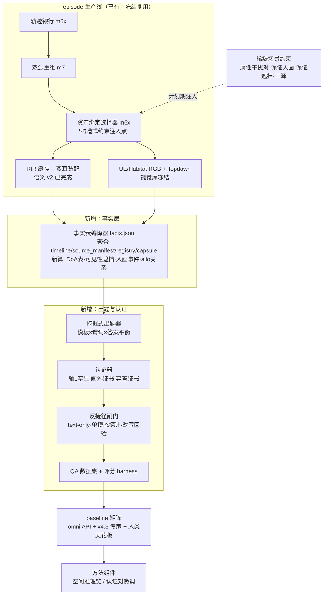

# AVEngine 认证式空间视听 QA 基准 —— 机制级设计与执行文档

> 本文档为 goal 模式自足文档：新会话仅凭本文档 + 仓库即可继续工作。
> 状态：owner 评审中的设计草案 v2（2026-07-27）。
> 修订：v2 吸收 owner 反馈——语音用现成剪辑+已知转写（不做 TTS）；
> 明确复用既有轨迹生成与属性 flag 机制；补背景/流程图/TODO/全题型例子。

---

## 1. 背景与现状（新会话必读）

### 1.1 仓库与分支（精确规范）

主仓库 `/data/jzy/code/AVEngine`（remote `git@github.com:Eastforward/AVEngine.git`），
多 worktree 布局：

| worktree 路径 | 分支 | 用途 | 状态 |
|---|---|---|---|
| `/data/jzy/code/AVEngine-habitat-native` | `cc-instance-attr-generalization` | 并行会话：coat 注册/provenance（QA 的 P2' 依赖它） | 未合并 |
| `/data/jzy/code/AVEngine-habitat-native-acoustic-fix` | `cc-acoustic-material-fidelity` | **本设计的工作区**。含本文档（提交 a3805ae） | 前三提交已合并 |
| `/data/jzy/code/AVEngine-v43-model` | `feature/v43-binaural360-model` | owner 私有模型实验，**永不合并进公开分支** | 独立 |

- 公开主线：`feature/habitat-native-avengine`（当前 1fd3537，领先 origin 4 提交，未 push）。
- **QA 基准的实现工作**：在本 worktree 新建分支 `cc-qa-benchmark`
  （从 `cc-acoustic-material-fidelity` 头部切出，继承本文档），
  owner 评审后快进合并进 feature 主线。SPEAR 仓库
  （`/data/jzy/code/AVEngine/external/SPEAR`，独立 git，`git status -uno`）
  只在资产生成时涉及，QA 工作不动它。

### 1.2 环境（不要用错，错了静默失败）

- 单元测试/纯 Python 工具：`/data/jzy/code/AVEngine-habitat-native-acoustic-fix/.venv/bin/python`
  （本 worktree 专属 venv，editable 指向本 worktree src）。
- native 渲染（Habitat/RLR）：
  `HABPY=/data/jzy/miniconda3/envs/avengine-habitat-runtime/bin/python`，
  调用模式：`PYTHONPATH=$REPO/src`、`AVENGINE_REPOSITORY_ROOT=$REPO`、
  `AVENGINE_HABITAT_RUNTIME_ROOT=/data/jzy/code/habitat-sim-AVEngine`、
  `AVENGINE_EVIDENCE_ROOT=/data/datasets/avengine_workspaces/AVEngine-habitat-native-acoustic-fix/tmp`、
  `cd $REPO` 后运行（pinned runtime 要求 quaternion 先于 habitat_sim 导入，
  由 M3 runtime bridge 处理，勿手工 import habitat_sim）。
- v4.3 私有实验：`/data/jzy/miniconda3/envs/locate/bin/python`（勿用于公开侧）。
- 本 worktree `tmp/` 是符号链接 → 外置存储（上面 EVIDENCE_ROOT 路径）。

### 1.3 已完成（截至 2026-07-27）

- [x] 声学材质保真修复（已合并 feature@1fd3537）：语义材质规则 v2
  （`examples/m3/semantic_materials/residential_material_rules.json`）、
  UE visual-slot 语义编译适配器（`avengine m3 compile-visual-slots-semantic`）、
  传播参数 v2（`examples/runtime/rir_cache_simulation_request_v2.json`，
  深度200/SH3/透射开）。
- [x] Apartment 训练音频语义 v2 重渲：RIR 缓存 9,047 全 pass +
  1,000 条双耳批 + 工件级验证 pass。产物：
  `tmp/m7/apartment_generated_assets_rir_cache_unique1000_semantic_v2_20260726_01`、
  `tmp/m7/apartment_generated_assets_1000_unique_visual_binaural_semantic_v2_20260726_01`。
  注意：**同 1,000 条 episode 存在两个声学实现**（旧占位材质版在旧 worktree
  tmp，新语义 v2 版在本 worktree tmp）——这就是"轴 3"孪生数据（§8）。
- [x] Kujiale 零样本评测音频规则 v2 重渲（2,587 RIR + 100 混音）：
  `tmp/m7/kujiale_0020_balanced360_binaural_rules_v2_20260726_01`。
- [x] MP3D 第二房间启用：habitat_native room profile
  （`examples/runtime/room_runtime_profiles.json` rev 20260726_v3）+
  Habitat 批量 RGB runner（`tools/m7/run_habitat_room_batch.py`，
  分片/断点续跑/readback 已实战验证）。
- [x] 本设计文档（a3805ae）。
- [~] 进行中：v4.3 在语义 v2 音频上重训（GPU2，100ep b56，输出
  `tmp/m7/v43_binaural360_training_semantic_v2_100ep_b56_20260727_01`），
  完成后做同房间 + Kujiale 跨房间对比（归因 10°→60° 崩塌）。
- [~] 并行会话（勿重复其工作）：SPEAR `cc-asset-pipeline-hardening`
  （资产管线硬化/柴犬出货）；habitat-native `cc-instance-attr-generalization`
  （coat 注册与 provenance——**P2' 的 L9 变体依赖此分支合并**）。

### 1.4 论文定位（一句话）

> 首个对每道题附带机器可验证的模态必要性证明（certificate）的空间视听
> 问答基准；问题、答案、证明全部由物理一致仿真引擎程序化生成；
> 展示 omni-model 系统性失败 + 一个针对性修复。
> 三支柱：反事实认证 / 画外→入画 / instance 级属性绑定；
> 弃答内嵌在答案空间。未来文章分工见 §9。

---

## 2. 复用地图：owner 已有的算法/函数 → 本设计中的角色

**设计纪律：事实表编译器是聚合层，不重算已有真值。** 已存在并直接复用：

| 已有机制 | 位置 | 在本设计中的角色 |
|---|---|---|
| 轨迹生成：可行区编译 + 栅格寻路 + 轨迹银行 | `src/avengine/m6x/room_feasibility.py`；`tools/m6x/compile_apartment_feasibility_bank.py` | episode 生产不改动；构造式约束只加在**选择器**层 |
| 双源重组（400 组件→4,000 有序组合） | `tools/m7/recombine_source_trajectory_bank.py` | 复用 |
| 资产绑定选择器（NavMesh 门控 + 确定性均衡） | `tools/m6x/select_asset_bound_trajectories.py` | **构造式约束的注入点**（§5）；balanced-360 选择器（`tools/m7/build_room_evaluation_plan.py`）是同机制先例 |
| 事件窗 schema：`source_manifest.json.events[]`（integer tick 起止） | 每 episode `metadata/source_manifest.json`（`avengine_m5_1_*`） | **间歇发声=在此数组声明多窗**，不发明新 schema |
| 三态属性 flag 机制（pass/fail/not_evaluated + evidence） | `avengine_m5_1_flag_report_v1`；重评函数在 `src/avengine/m5_1/`（source_contracts/flags 权威） | 事实表的 flag 字段=调用既有重评函数补算（批量模式下现为 `not_evaluated`） |
| Timeline v2（actors/frames/audio_events，48kHz tick 权威） | 每 episode `metadata/timeline.json`；`src/avengine/m5/timeline.py` | 逐帧位姿/相位真值来源 |
| 实测 emitter 锚点（嘴部偏移） | `examples/runtime/source_asset_runtime_profiles.json`；`src/avengine/m6x/asset_emitter.py` | 发声点世界坐标 |
| 场景锚点/家具 OBB | M6.x RoomCapsule 锚点库 + 障碍快照（`examples/m6x/fixed_apartment/room_capsule.json`） | allocentric 谓词的参照物 |
| 逐帧 DoA/距离数学 | v4.3 标签管线（私有分支 `avengine_v43/labels.py`）同一几何 | 公开侧重实现一份等价函数（不 import 私有分支） |
| 反事实构建器（route_swap，视觉字节相同） | M5 counterfactual builder | 轴 1 孪生生成（§7） |
| 静默可见干扰源 / 移动间歇声源 | M6.x S2 / S3 场景机制 | 属性干扰对与间歇 program 的原型 |
| 语义分割 sensor（逐帧实例 mask） | M1 capture 三模态 rig；M5.1 semantic visibility gate | modal mask 来源（§4.1） |
| AudioProgram 六模式词表（含 `intermittent_events`） | `src/avengine/m6/audio_program.py` | 间歇窗的契约出处 |

**需要新写的只有**：事实表编译器（聚合+四个新计算：DoA 表、可见性/遮挡、
入画事件、allocentric 关系）、挖掘式出题器、认证器、反捷径闸门、评分 harness、
间歇窗到批量装配的接线、三源计划扩展。

---

## 3. 总架构与流程图

**设计决策 #1：九成挖掘、一成构造。** 不做"先定题再逆向搜轨迹"；
事实表上挖掘已成立的模式来出题，稀缺场景才在计划期注入约束。

---

## 4. 数据层：四个扩展（按依赖排序）

### 4.1 间歇发声事件窗（复杂题前提）——复用 events schema

真值靠**声明**不靠检测：在 `source_manifest.events[]` 里声明多个子窗
（如 bark#1=[16000,28800) 采样、bark#2=[48000,60800)），装配时按窗对
干声 fade 门控。窗即真值，零误差。接线点：
`tools/m7/render_asset_bound_binaural_batch.py` 增加 program-gated 变体
路径；**RIR 缓存完全复用**（缓存键与干声无关）。M6.x S3 已有移动间歇原型。

### 4.2 语音：现成剪辑 + 已知转写（owner 决定，不做 TTS）

内容题（"说'过来'的人在哪侧"）用**现成语音剪辑**，转写已知即可：
- 首选带官方转写的语料（现有 sound registry 中 LibriTTS 人声本身自带
  文本，CC-BY-4.0）；omniaudio 库内剪辑可用 ASR 转写 + 人工抽检确认。
- sound registry 增加字段：`content_transcript`（必填 for speech）、
  `transcript_source`（`corpus_official` / `asr_verified`）、
  `speaker_persona`、`language`。转写不可靠的剪辑不入内容题池
  （fail-closed：无 `corpus_official` 或未过人工抽检的不发内容题）。
- 脚本化因果链（"喊话后狗靠近"）不依赖语音合成：episode 是编排的，
  把喊话事件窗结束 tick 与狗的轨迹转向 tick 按声明延迟对齐即可，
  时序真值精确到 tick。诚实边界：编排相关性，非动物行为学，写进数据卡。

### 4.3 L9 realizer 变体（instance 干扰项制造机）——依赖并行分支

同品种异 coat 干扰项来自确定性 realizer（非重新生成）。
**依赖：`cc-instance-attr-generalization` 分支的 coat 注册工作合并**；
之后把三个生成资产的 coat profile 注册进 `COAT_PROFILE_DOMAINS` 并出
变体 revision。在该依赖落地前，属性题先用跨品种干扰（边牧 vs 拉布拉多
毛色不同即可出题，硬度较低但可先跑通）。

### 4.4 三源子集（数量/比较题载体，唯一的大扩展）

M4 原生 N 源传播现成；扩展在计划层：配对模板 schema slot 写成
`source1..sourceN`（v1 填到 3）；RIR 计划去重逻辑按 (源位置,listener)
对工作无需改；选择器加三源互距下限。v1 规模 100–200 条。

---

## 5. 事实表（facts.json）规范

每 episode 一份，hash 绑定，schema `avengine_qa_fact_table_v1`。
字段与来源（★=新计算，其余聚合自现有产物）：

| 字段族 | 内容 | 来源/机制 |
|---|---|---|
| `instances[]` | 实例 id、species/breed/coat/size、slot 绑定、最小消歧描述 | runtime registry |
| `sound_events[]` | 源 id、类别、tick 窗、transcript（若语音） | `source_manifest.events[]`（§4.1 多窗后天然多条） |
| `poses[t]` | 逐帧 root + emitter 世界坐标 + 朝向 | `timeline.json.actors` + registry emitter 偏移 |
| `motion[t]` | moving/static + 速度 | poses 差分，阈值 0.05 m/s 写入 schema |
| ★`doa[t]` | 每实例相对 listener 方位/仰角/距离 | listener 位姿 + emitter 的解析几何（与 v4.3 标签同数学，公开侧独立实现） |
| ★`visibility[t]` | 视锥内否、modal 像素、amodal 像素、遮挡分数 | §5.1 双渲染差分 |
| ★`frame_events[]` | 入画/出画帧号 + 入画点图像坐标 | §5.2 视锥边沿 |
| `anchors[]` | 桌/沙发等 OBB | RoomCapsule 快照 |
| ★`relations[t]` | 相对锚点的 左/右/前/后侧、距离、最近实例 | §5.3 解析几何 |
| `flags` | 三态语义 flag（重评后） | m5_1 既有重评函数补算 |

### 5.1 遮挡：双渲染差分（回答"如何专门查看遮挡"）

1. modal mask：semantic sensor 逐帧实例分割（现成）。
2. amodal mask：同机位**只加载该实例**再渲一遍 semantic
   （新增诊断 pass，纯 semantic 无光照，每 episode 秒级；不进数据集媒体）。
3. 遮挡分数 = 1 − |modal|/|amodal|；在视锥内且 amodal>0、modal=0 →
   完全遮挡；"下半身被桌挡"= modal 缺失区域 depth 与桌 OBB 求交判定。

### 5.2 入画/出画：视锥边沿检测

逐帧对实例 amodal bbox 做视锥测试（相机位姿+HFOV105° 现成）；
0→1 边沿=入画帧，入画点=该帧 bbox 与画面边缘交线中点。
音频无 FOV 门控（`audio_visibility_policy: 360_degree_no_camera_fov_cutoff`
已是既有契约字段），画外方位直接查 `doa[t<t_entry]`。

### 5.3 allocentric（二级推理）谓词

实例位置变换进锚点 OBB 局部系，象限→左/右/前/后侧。**参照系约定写进
schema 并记录在每道题元数据**（如"桌左以房间主朝向为准"），杜绝歧义。
相机系与锚点系是两列，天然支撑 ego/allo 诊断轴对照。

---

## 6. QA 类型全集（每类至少一例，type id 入 schema 注册表）

### A 组 简单感知题（8 类）

| ID | 例题 → 答案 | 事实字段 | 证书 |
|---|---|---|---|
| `Q-ATTR` 属性绑定 | "正在叫的那只狗是什么毛色？" → 黑白色 | sound_events×instances.coat | 轴1（孪生里换路由→答案变另一只的毛色） |
| `Q-LOC-EGO` 相机系定位 | "猫此刻在画面左侧还是右侧？" → 左侧 | visibility+doa | 画外变体（在画外时纯视觉必错） |
| `Q-LOC-ALLO` 物体系定位 | "人站在圆桌的哪一侧？" → 窗侧 | relations | ego/allo 对照对 |
| `Q-ACT` 动作状态 | "比格犬在走动还是静止？" → 走动 | motion | 轴1变体："正在叫的那只在走还是停" |
| `Q-CNT` 数量 | "画面中现在有几只狗？" → 2 | visibility+instances | 画外变体："含画外，场景里有几只狗在叫过？" |
| `Q-CMP` 比较 | "两只狗谁离你更近？" → 边牧 | doa.distance | 数值孪生（Q-NUM-DIST 同源） |
| `Q-SRC` 声源识别 | "刚才的叫声是狗还是猫？" → 猫 | sound_events.class | 轴1 |
| `Q-AVREL` 音画关系 | "狗叫来自你的左侧还是右侧？" → 右侧 | sound_events×doa 符号 | 轴1 + 数值孪生 |

### B 组 复杂题（时间事件锚定的跨模态绑定，11 类）

| ID | 例题 → 答案 | 谓词要点 |
|---|---|---|
| `Q-TEMP-AFTER` | "狗连续叫两声后，哪只动物最先绕到圆桌左侧？" → 大型浅色金毛 | 锚 T=bark#2.end；各实例首次 `side_of(table)=left` 帧 argmin，赢者领先≥5帧 |
| `Q-TEMP-DURING` | "人说话期间，深色比格犬在走还是站？" → 走 | 窗=speech 窗；motion 众数 |
| `Q-TEMP-BETWEEN` | "两次猫叫之间，谁从相机前方经过？" → 绿衣女 | 窗=两 meow 窗之间；doa.azimuth 穿 0° 且 distance<阈值 |
| `Q-TEMP-AT` | "护士开始说话时，金毛在桌哪侧？" → 左侧 | t*=speech.start_frame 的 relations 快照 |
| `Q-TEMP-ORDER` | "男人说完后，哪只动物最先开始移动？" → 虎斑猫 | 锚=speech.end；motion 0→1 边沿 argmin |
| `Q-BIND-SPA` | "第一声从左侧来的狗叫，是深色狗还是浅色狗发的？" → 深色 | 事件窗×doa 符号×coat 三表连接 |
| `Q-BIND-NEAR` | "声音离你最近的那次狗叫是哪只狗？" → 桌右的比格 | 逐 bark 窗 min(distance) |
| `Q-CAUSE` | "女人喊'过来'后，哪只狗开始向她靠近？" → 大金毛 | 脚本化：喊话窗结束后 dist(dog,woman) 单调下降的实例（§4.2） |
| `Q-CONTENT` | "说'猫在桌子旁边'的人在你左侧还是右侧？" → 右侧 | transcript 匹配事件窗 × doa 符号 |
| `Q-OCC` | "第一声猫叫时，猫有没有被圆桌遮挡？" → 有，下半身被挡 | t*=meow#1.start；occlusion_score>0.3 + 遮挡源判定 |
| `Q-ENTRY` | "一直在画外叫的那只动物，从画面哪侧进来的？" → 左侧 | frame_events.entry + 入画点坐标；前置：入画前有发声窗 |

（出画对称型 `Q-EXIT`："出画后它还叫过吗？"——frame_events.exit ×
sound_events 窗比较，归入本组。）

### C 组 数值题（4 类，分带计分）

| ID | 例题 → 答案 | 计分 |
|---|---|---|
| `Q-NUM-DOA` | "第一声狗叫时它在你哪个方位？" → 左40°（=-40°） | ±10° 满分 / ±30° 半分 |
| `Q-NUM-DIST` | "那声猫叫离你大约多远？" → 2.5 米 | ±0.5m / ±1.5m |
| `Q-NUM-CNT` | "整段里狗一共叫了几声？" → 3 | 精确匹配 |
| `Q-NUM-TIME` | "狗第一次叫在第几秒？" → 第1.0秒 | ±0.3s / ±1.0s |

### D 组 弃答题（2 类，构造性可证明）

| ID | 例题 → 答案 | 构造 |
|---|---|---|
| `Q-ABST-FB` | "画外那声叫来自你正前方还是正后方？" → 无法判断 | 静头 HRTF 前后镜像物理不可分（README 既有声明）+ 全程无视觉线索 |
| `Q-ABST-MISS` | "那只在叫但全程被挡住的猫是什么毛色？" → 无法判断 | 全程 occlusion_score≈1 且从未入画；同模板在别的 episode 上可答——模型必须真看才知道能不能答 |

### E 组 认证孪生示例（评测形态展示）

同一道 `Q-SRC`："刚才的叫声是谁发出的？"
- episode `..._0036`（原始）：source1=边牧吠 → 答案"边牧"；
- episode `..._0036__cf`（孪生，视觉字节相同，干声路由互换）：→ 答案"猫"。
评分新指标**认证一致率**：模型在孪生对上答案翻转的比例——
"答案是否追踪音频"的直接度量，与准确率正交报告。

---

## 7. 认证、反捷径、评分（机制摘要）

- **轴 1 孪生**：M5 route_swap 复用；RIR 缓存命中 → 每条秒级；生成器在
  孪生事实表上重答验证翻转成立才发证（证书按题检查后挂，不按模板承诺）。
- **画外证书**：所需实例在证据窗内 `visible_in_frustum=False` 的几何判定。
- **弃答证书**：D 组构造记录 + "正确行为=弃答"声明。
- **反捷径闸门（生成期）**：答案直方图平衡 → text-only LLM 裸答须≈随机
  → vision-only/audio-only 探针留档 → LLM 改写 2–4 形式且回验答案不变
  → 分层抽样人检 + 人类天花板（耳机强制）。
- **评分**：MCQ 准确率（含弃答）按六诊断轴切片（认证类型/ego-allo/
  画内外/干扰级/时间锚定深/答案类型）；认证一致率；数值分带+圆周 MAE
  双报；过度自信率。

---

## 8. 预留钩子（未来文章 → 现在动作）

| 未来论文 | 现在预留 |
|---|---|
| NeurIPS 方法（反事实对齐/RLVR） | `--retain-stems` 开启；QA 溯源记录=过程奖励 verifier 输入；schema 加 `acoustic_realization_id`——**轴3 数据已存在**（同 1,000 episode 的占位材质版 vs 语义 v2 版双实现） |
| ICCV 画外入画预测+4D 轨迹 | §5 的 poses/visibility/frame_events 就是全部标签，零重渲开工 |
| 具身 AVQA（2028） | RIR 缓存按 navmesh 网格采样 listener；FOA 开关保留 |
| 合作线（AV Trust Memory 导航） | 间歇窗与 belief 评测共用；事实表=belief error 真值源 |
| 跨房间泛化 | 轴3 双实现 + Apartment/MP3D 双房间就位；v4.3 重训结果（进行中）给第一次归因 |
| 发布审计 | 每 QA 带 rights 字段；RLR CC BY-NC 进数据卡 |

---

## 9. TODO（goal 模式执行清单，按依赖序）

**工作区**：`/data/jzy/code/AVEngine-habitat-native-acoustic-fix`；
**实现分支**：`cc-qa-benchmark`（首个任务时从 `cc-acoustic-material-fidelity`
切出）；测试用本 worktree `.venv`；native 用 §1.2 模式；
产物入本 worktree `tmp/`（外置），大文件不进 git；
遵循仓库纪律：fail-closed、schema 版本化、hash 绑定、四值状态词表、
提交信息英文、每步跑 `tests/unit`。

- [ ] **P0 事实表编译器 v1**（纯离线，最先落地）
  - [ ] `src/avengine/qa/fact_table.py`：聚合 timeline/source_manifest/
        registry/capsule → instances/sound_events/poses/motion/doa/
        anchors/relations（DoA 数学参照 v4.3 标签定义独立实现）
  - [ ] schema `avengine_qa_fact_table_v1` + 单元测试（合成 timeline 夹具）
  - [ ] 跑通现有 1,000 episode → 1,000 张事实表 + 统计报告
- [ ] **P0' 简单题挖掘闭环**（验证架构）
  - [ ] `src/avengine/qa/miner.py`：A 组 8 类模板 × 谓词 × 答案平衡
  - [ ] 抽 50 题人工目检（owner 看样张）
- [ ] **P1 可见性/遮挡/入画**（需要 native）
  - [ ] amodal 诊断 pass（object-only semantic 渲染）接进事实表编译器
  - [ ] frame_events + Q-OCC/Q-ENTRY/Q-LOC-EGO 画外变体解锁
- [ ] **P1' 轴 1 孪生**（与 P1 并行）
  - [ ] route_swap 批量装配（RIR 缓存命中）+ 孪生事实表重答验证器
- [ ] **P2 间歇事件窗**
  - [ ] `source_manifest.events[]` 多窗声明 + 批量装配 fade 门控路径
  - [ ] B 组时序题解锁（Q-TEMP-*、Q-BIND-*、Q-NUM-CNT/TIME）
- [ ] **P2' 属性干扰对**（依赖 `cc-instance-attr-generalization` 合并）
  - [ ] coat profile 注册 `COAT_PROFILE_DOMAINS` + 变体 revision
  - [ ] 干扰对配对模板（复用 S2 静默可见源机制）；未合并前先跨品种干扰
- [ ] **P3 扩展场景**
  - [ ] 语音内容字段（`content_transcript` 等）入 sound registry schema
        + 内容题（现成剪辑+官方转写，无 TTS）
  - [ ] 三源计划扩展（slot schema `source1..sourceN`，v1 填 3，100–200 条）
  - [ ] MP3D episode 银行（source-agnostic 可行性编译器 + Habitat 批量
        runner 均已就位，缺 MP3D 轨迹银行编译配置）
- [ ] **P4 闸门与 harness**
  - [ ] text-only/单模态探针闸门 + LLM 改写回验 + 评分 harness
        （六诊断轴切片 + 认证一致率 + 数值分带）
  - [ ] 人检协议与人类天花板测量
- [ ] **P5 基线与方法组件**
  - [ ] omni API 评测脚手架（GPT-4o/Gemini/Qwen-Omni）+ v4.3 专家基线
        （数值题同场）+ 单模态探针
  - [ ] 方法组件双小样：空间推理链 vs 认证对轻量微调，择优进正文
- [ ] （独立线，等 GPU2 训练完成）v4.3 语义 v2 同房间/跨房间对比报告

---

## 10. 待 owner/导师拍板

1. MCQ 为主、开放式附属（本文档假定）？
2. 数值分带宽度（±10°/±30°；±0.5m/±1.5m；±0.3s/±1.0s）？
3. 三源子集进 v1（假定进，100–200 条）？
4. 轴 3 归属：留 NeurIPS 方法篇（假定），还是进 CVPR 第四支柱？
5. 方法组件选型：推理链 vs 认证对微调（建议双小样择优）。
6. 人物属性题 v1 降级为"哪个人"级别（假定），还是投入人类外观变体？
7. ~~TTS 还是现成音频~~ 已定：现成剪辑 + 已知转写（§4.2）。
