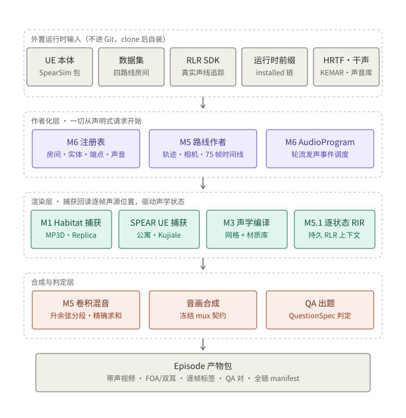

# AVEngine

AVEngine 是一个按房间家族选择生产视觉后端的研究工具，用于从明确的
声源资产、房间、动作程序和证据合同构建可复现的视听 episode。

MP3D 的场景、视觉、传感器和姿态执行由 Habitat-Sim 提供；原生
`apartment_0000` 与 InteriorAgent/Kujiale 的生产视觉由 UE/SPEAR
提供。RLR Audio Propagation 提供几何声学传播，MP3D 使用同一 Habitat
场景上的 SoundSpaces 材质权威。AVEngine 统一负责资产与房间包、权威
时间线、多声源音频组装、质量检查、来源记录和数据准入。

## 主要能力

- 单一 Camera/Listener rig 上共位的 RGB、Depth 和 Semantic 采集；
- 命名动态声源、逐源 FOA/双耳 RIR、stem 和混合音频；
- 精确整数 tick 时间线、同步媒体和受控反事实 episode；
- Camera/Listener 动态轨迹，以及同帧 Topdown、DOA 和距离标签；
- 版本化房间、资产、声源端点、声音和运行配置注册表；
- SoundSpaces、Habitat 和 SPEAR/UE 房间来源到统一 RLR 声学包的路由；
- 资产、房间、媒体和数据集的失败关闭式质量检查。

AVEngine 不是新的模拟器、渲染器或声学求解器，也不会根据视觉材质自动
推断真实物理声学。生成出文件不等于资产、房间或数据集已经准入。

## 系统流程

```text
任务请求
  → 资产、房间和声学场景包
  → 声源程序、Camera/Listener 轨迹和权威时间线
  → 按房间路由的 Habitat 或 UE/SPEAR 视觉执行 + RLR 传播
  → 每源音频、混合音频、RGB、Topdown、DOA、距离和标签
  → 质量检查、来源记录和数据索引
```



生成动物必须在修复、绑定、动画和运行验证中保留自己的 Pixel3D 几何。
库中动物可以提供动作，但不能替换生成动物的 mesh、轮廓、关节或蒙皮
权重。

## 开始使用

协作者必须在自己的个人目录下载并安装 Miniconda，创建自己的 Conda
环境、源码副本、构建目录和 `tmp` 输出。禁止复用项目所有者或其他成员
的环境。

修改任何代码之前，必须先把目标仓库 Fork 到自己的 GitHub 账号，
克隆自己的 Fork，并从规定的上游基线创建一个新的任务分支。一项任务
对应一个新分支；禁止直接在 `main`、固定运行时分支或他人的分支上开发，
也禁止直接向上游仓库推送。完整流程见协作构建文档。

先阅读：

- [同服务器协作与个人环境构建](docs/quickstart.md)
- [功能与使用指南](docs/usage_guideline.md)

完成项目指定 Conda 环境的选择/激活后，直接在其中 bootstrap：

~~~bash
source "${AVENGINE_MINICONDA_PREFIX}/etc/profile.d/conda.sh"
conda activate "${AVENGINE_ENV_PREFIX}"
test "$CONDA_PREFIX" = "${AVENGINE_ENV_PREFIX}"

cd "${AVENGINE_CODE_ROOT}/AVEngine"
./scripts/setup.sh --profile fast_unit
~~~

正常 bootstrap 只使用已激活的 Conda Python；也可在非交互 shell 中显式传入
--python "${AVENGINE_ENV_PREFIX}/bin/python"。它会拒绝系统 Python、普通
venv 和与已激活 CONDA_PREFIX 不一致的解释器，并且不会创建 .venv。

Linux、Git 和 Python 3.10 或更新版本是上层最低要求；当前原生参考环境
使用 Python 3.12。Habitat/RLR 原生构建、外部 UE 安装、场景数据、
Blender 和媒体读回属于独立测试层。Apartment/Kujiale 的 UE 层是对应
房间的生产视觉层，不因为它不是 fast bootstrap 的默认依赖而变成对照层。

## Studio 与审阅页（owner 速查）

### Studio：浏览器 3D 场景编辑与渲染任务台

完整指南见 [docs/studio/USAGE.md](docs/studio/USAGE.md)。速查：

服务器上启动（通常已常驻，先 `pgrep -af run_studio_server` 确认）：

~~~bash
cd /data/jzy/code/AVEngine-lead-a
nohup /data/jzy/miniconda3/envs/avengine-habitat-runtime/bin/python \
  tools/studio/run_studio_server.py --config tools/studio/studio_config_48g.json \
  > /data/jzy/tmp/studio_server.log 2>&1 &
~~~

服务只绑服务器回环，本机先开隧道再访问：

~~~bash
ssh -L 8765:127.0.0.1:8765 48g-jump
~~~

浏览器打开 `http://127.0.0.1:8765/studio`。三个房间（公寓 UE 生产链 /
MP3D 整屋 / ReplicaCAD）；公寓房内可拖拽人/犬起止点标记（绿=草稿校验
通过，红=不在可行域），按端点允许类别换声音并试听，然后一键把完整
渲染链（视觉捕获 → 动态双耳音频 → 带声成片）排进 GPU 任务队列，任务
面板可查队列与产物。浏览器里的校验是草稿级预演，渲染链内的原生闸门
才是权威。

场景包由 `tools/studio/build_studio_scene_bundle.py` 预构建（读 M3
声学包三角网格；运行期不依赖任何 rgb.npy，批次 npy 退休不影响
Studio）。新增/更换房间或 UE stage 后，改
`tools/studio/studio_config_48g.json` 里 task_templates 的对应路径。

### QA 批次审阅页：审题、看片、查产物

每个 QA 批次生成一个自包含静态审阅页
（`tools/qa/build_batch_review_page.py`，懒加载 + 进度条 + 题型/闸门
筛选；批次生产期间循环模式每 5 分钟自动与文件夹对齐，收官后固化为
终版）。当前常驻两个：

| 批次 | 服务器目录 | 端口 |
|---|---|---|
| pilot48（48 点 / 194 题） | `/data/avengine_external/review/qa_v2_pilot48_review_page` | 8901 |
| batch2d（192 点 / 909 题） | `/data/avengine_external/review/qa_v2_batch2_review_page` | 8902 |

本机访问：

~~~bash
ssh -L 8901:127.0.0.1:8901 -L 8902:127.0.0.1:8902 48g-jump
~~~

浏览器打开 `http://127.0.0.1:8901/`（pilot48）或
`http://127.0.0.1:8902/`（batch2d）。页面含每点带声成片播放、题目与
答案、孪生配对、音频程序与时序等全部相关信息。若某端口服务未在跑，
在对应目录里执行 `python3 -m http.server <端口> --bind 127.0.0.1`。

## 当前状态

保留的 v1 schema/document/receipt/JUnit reader 只用于读取 checkout-era
历史证据；`receipt`、`prepare`、`verify`、`verify-attestation` 虽保留旧
参数、默认值和 help，但有效调用会在路径解析、Git、子进程或写入之前结构化
失败。保留的 v1 manifest 精确记录它当时的 M6 发布状态；下文所说的历史
“唯一依据”不验证当前源码迁移，schema-only 读取也不构成新的正式验证。

`main` 是当前单仓一条龙基线：精选 Habitat 与 SPEAR 集成源码、AVEngine
自有的 RLR 调用/适配源码和小型 AVEngine 配置已全部迁入本仓库，并于
2026-08-22 经 PR #2 合入。现有 Apartment 研究路线支持通用
`source1`、`source2` 绑定、双声源任务、精确时间线、RLR 双耳音频、
Topdown/DOA/距离标签、动态 Camera/Listener 和 episode 级
训练/验证/测试划分。

源码单仓迁移已完成闭环：引擎运行与重建不再依赖任何其他 Git 检出
（含转轨期的 Habitat fork、SPEAR checkout 与 sound-spaces）。RLR 传播
引擎、头文件、库和 SDK 配置是用户合法安装的 CC BY-NC 4.0 外部 SDK，
永不进入 AVEngine Git。bootstrap 不 clone、fetch 或默认解析
Habitat/SPEAR/RLR checkout；原生执行必须显式提供非 Git 的 installed
Habitat prefix、Magnum Python site、MP3D 数据与 RLR SDK（重建配方见
[`docs/provenance/RUNTIME_PREFIX_RECIPE.md`](docs/provenance/RUNTIME_PREFIX_RECIPE.md)）。
保留的 checkout-era 证据和 v1 reader 只用于历史兼容，不能替代当前入口。
迁移完成已由迁移前后相同房间路由的实际结果与 owner 评审确认：四路线
画面、S 系列声学、MP3D/Apartment 动态音频与左右基准均已过审，拔线验证
（进程溯源、fresh clone、纯外置输入全链）记录在
docs/roadmap/CURRENT_APARTMENT_EXECUTION.md 的 20260821f–20260822b
检查点。这不改变数据准入：正式数据集分母仍为 0。

这些结果保留各自的证据边界，不代表所有生成动物、房间声学或数据集已经
正式准入。请以以下记录为准：

- [当前 Apartment 执行状态](docs/roadmap/CURRENT_APARTMENT_EXECUTION.md)
- [里程碑与证据状态](docs/roadmap/MILESTONES.md)
- [发布清单](release/avengine_release_manifest_v1.json)

当前 release manifest 仍是正式发布状态的唯一依据。分支、
数据结构、预览文件、文档目标或单元测试通过都不能单独代表单仓迁移完成或
正式发布。

## 仓库职责

唯一目标源码仓库是
[`USTB-AVEngine/AVEngine`](https://github.com/USTB-AVEngine/AVEngine)。它
包含 AVEngine 任务包、注册表、时间线、音频组装、质量检查、来源记录、
命令行，以及最终精选迁入的 Habitat 与 SPEAR 集成源码、RLR 适配源码和
小型 AVEngine 配置。RLR 传播引擎、头文件、库和 SDK 配置是用户合法安装的
CC BY-NC 4.0 外部 SDK，永不捆绑进 AVEngine Git。单仓完成后不再需要 RLR
Git checkout、submodule 或源码路径；这不表示迁入 RLR engine。来源映射与
许可证分别记录在
[`UPSTREAM_ADAPTATIONS.md`](docs/provenance/UPSTREAM_ADAPTATIONS.md) 和
[`THIRD_PARTY_NOTICES.md`](THIRD_PARTY_NOTICES.md)。

这不表示把所有依赖和数据塞进 Git。Unreal Engine 安装、Epic 内容、
MP3D、InteriorAgent/Kujiale、原生 Apartment 地图、模型权重、环境、
构建目录和生成媒体始终留在仓库外。保留的 Habitat/SPEAR checkout 可以作为
迁移历史或只读对照来源，但不是当前 `setup`、installed-prefix writer 或新的
运行输入；新的 build/setup/run 不得克隆或解析第二个产品代码仓库。RLR 则继续
由用户安装的外部 SDK 提供，而非第二个源码仓库。gpuRIR 和私有生成模型路线仍是
显式可选研究工具。

已接线的 Habitat RLR adapter 默认关闭。启用其静态 C++ target 时，
`AVENGINE_RLR_SDK_ROOT` 必须指向用户安装的官方
`RLRAudioPropagationPkg` 目录（其中含 `headers/` 与
`libs/linux/x64/`）；
Runtime root 必须解析到非 Git 目录；官方 Git checkout 只用于获取或来源核对，不能作为 runtime root。AVEngine 不会搜索 RLR checkout、复制或安装该 `.so`。
Linux 运行依赖 adapter 的可执行文件或未来 binding 前，用户应让动态加载器
解析自己的 SDK，例如
`LD_LIBRARY_PATH="$AVENGINE_RLR_SDK_ROOT/libs/linux/x64${LD_LIBRARY_PATH:+:$LD_LIBRARY_PATH}"`。

A adapter 单独启用时仍保持 `ESP_BUILD_WITH_AUDIO` 关闭。独立且默认关闭的
`AVENGINE_HABITAT_BUILD_LEGACY_AUDIO_SENSOR` 才会在 Habitat core 中启用旧
`AudioSensor`，并使用同一外置 SDK 的 deprecated C++ wrapper；它不启用
Python bindings、package installation、runtime resolver 或完整传播运行时。
这只是外部 SDK 的加载方式，不迁入 RLR engine、头文件、库或 material data。

默认关闭的 `AVENGINE_HABITAT_BUILD_PYTHON_BINDINGS` 是独立的 M1 Python 3.12
扩展构建层。普通 staging 模式要求 `AVENGINE_HABITAT_PYTHON_OUTPUT_DIR` 位于
`native/habitat/` 外；它只写入 `habitat_sim/_ext/habitat_sim_bindings`，调用者
仍须自行提供 facade 与外置 Corrade/Magnum Python runtime。

另有默认关闭的 `AVENGINE_HABITAT_INSTALL_RUNTIME` 安装模式。它要求
`AVENGINE_HABITAT_BUILD_PYTHON_BINDINGS=ON` 和一个显式的
`AVENGINE_HABITAT_RUNTIME_PREFIX`，该 prefix 必须在 Habitat source 与 CMake
build tree 之外。`cmake --install` 会安装精选 `habitat_sim` facade、其 binding
和小型 default physics config；binding 本身先留在 build tree。configure 会拒绝
canonical prefix 下已有或为符号链接的 `habitat_sim` 与 `config` 目标根（`_ext`
由前者覆盖），也拒绝已有或为符号链接的完整 build-intermediate package target，
所以 install 不会沿预置深层符号链接写入。该 config 的
native 默认路径在 configure 时固定到此 prefix，因此不可在 `cmake --install`
时用另一个 `--prefix` 覆盖。Python `utils/settings.py` 读取 native
`SimulatorConfiguration` 的默认值，不再硬编码调用者 CWD 下的
`data/default.physics_config.json`。

M1 installed-runtime capture uses --runtime-prefix for that prefix. MP3D
manifest assets resolve only from AVENGINE_MP3D_ROOT, an external data root
containing scene_datasets/. M1 v2 evidence remains readable alongside v1, does
not treat the installed prefix as a Git checkout, and does not instantiate
AudioSensorSpec.

已用 fresh ordinary CMake configure 验证两个 H5 开关默认均为 OFF；另用 fresh
EGL/PIC Recast 外置依赖完整构建并安装此模式。无关 CWD 下的 `python -S` 隔离
import 只从安装 prefix 载入 facade 和 binding，并确认 native
`SimulatorConfiguration` 与 `utils/settings.py` 都指向该 prefix 下的绝对 physics
config 路径。

这仍不安装 Corrade、Magnum、pybind11、Python、RLR、PBR assets、数据集或
RPATH，也不改变 AVEngine runtime resolver；当前 bootstrap 只接受显式安装
prefix，不再以 manifest 固定 fork 作为执行路径。安装层完成和其 build/import
验证不等同于完整 Simulator 验证、source cutover 或正式发布。

Habitat 的 PBR IBL 图片同样是外部数据，不会嵌入源码或构建产物。
installed M7/M5.1 PBR actor 路线要求显式传入
`--pbr-asset-root`；该 non-Git 根必须包含
`bluts/brdflut_ldr_512x512.png`、
`env_maps/brown_photostudio_02_1k.hdr` 和适用的 `license.txt`。
AVEngine 在构造 Simulator 前载入仓库内 718-byte Brown Photostudio
PBR 小配置，把两个图片字段改成该根下的绝对路径，并读回
`enable_ibl=true` 与配置 flags。此路线不设置环境变量，也不添加 direct
light；MP3D 的实际 light count 仍为 0。通用 Habitat adapter 仍支持其他
调用者用相对 logical name 加 `AVENGINE_HABITAT_PBR_ASSET_ROOT`。无渲染器
或关闭 IBL 的路径不需要 PBR 图片。

## 文档

- [功能与使用指南](docs/usage_guideline.md)
- [Studio 使用指南](docs/studio/USAGE.md)
- [同服务器协作与个人环境构建](docs/quickstart.md)
- [系统架构](docs/architecture/SYSTEM_OVERVIEW.md)
- [仓库职责与接口边界](docs/architecture/REPOSITORY_BOUNDARIES.md)
- [生成动物资产与实例合同](docs/assets/GENERATED_ANIMAL_ASSET_AND_INSTANCE_CONTRACT.md)
- [声学场景与材质合同](docs/architecture/ACOUSTIC_SCENE_AND_MATERIALS.md)
- [时间线与 episode 合同](docs/architecture/EPISODE_AND_TIMELINE.md)
- [文件系统信任模型](docs/security/FILESYSTEM_TRUST_MODEL.md)
- [故障排查](docs/troubleshooting.md)

数据结构位于 [`schemas/`](schemas/)，可执行示例位于
[`examples/`](examples/)，里程碑复现命令位于
[`docs/roadmap/`](docs/roadmap/)。

## 状态词

证据使用 `pass`、`fail`、`blocked`、`not_run`、`research_only` 和
`qualified`。研究候选或历史批准不能在缺少当前证据和注册决定时升级为
`approved_for_dataset`。

## 许可与权利

见 [LICENSE](LICENSE)、[CITATION.cff](CITATION.cff)、
[CITATIONS.bib](CITATIONS.bib) 和
[THIRD_PARTY_NOTICES.md](THIRD_PARTY_NOTICES.md)。

AVEngine 当前保留所有权利，协作者必须获得项目所有者授权。Habitat、
RLR、模型、房间、声音和生成资产保留各自许可；当前 RLR 路线是
非商业研究用途。
