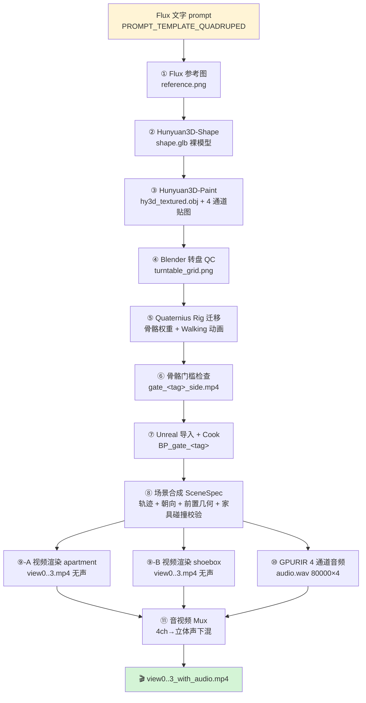
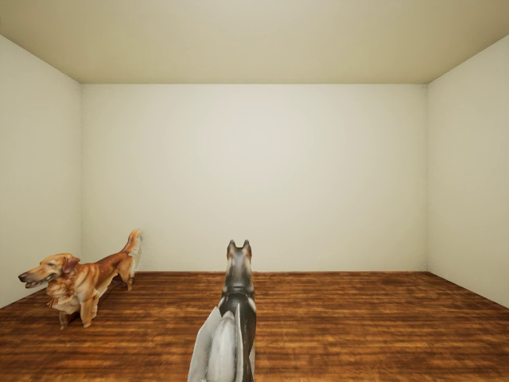
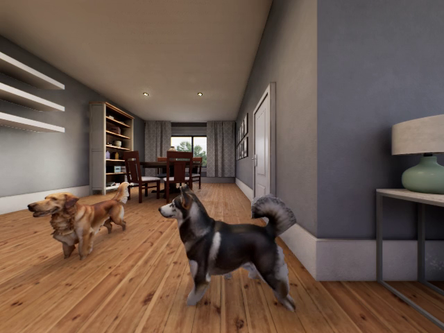
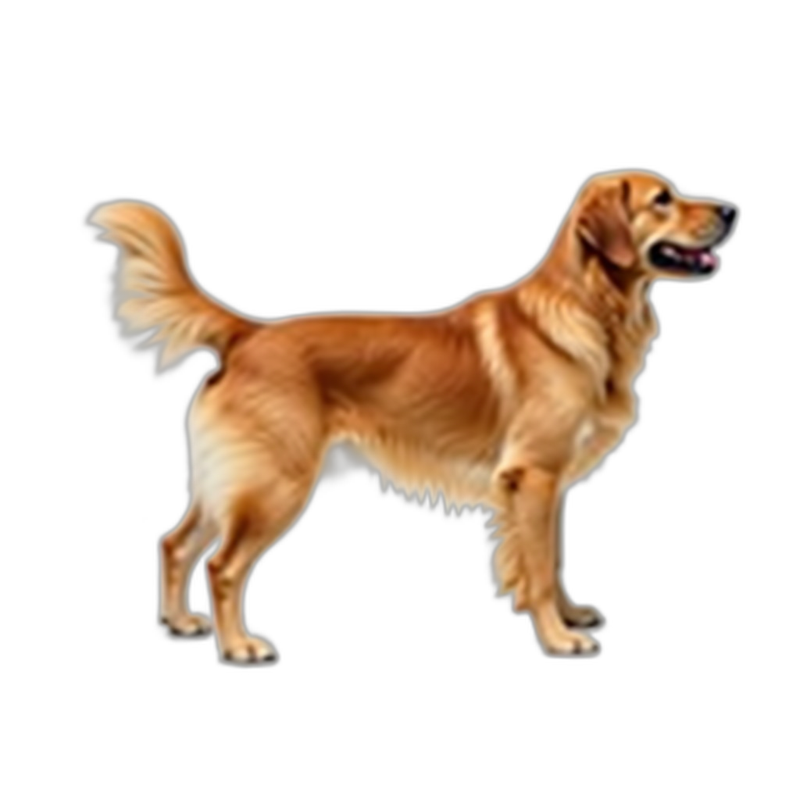
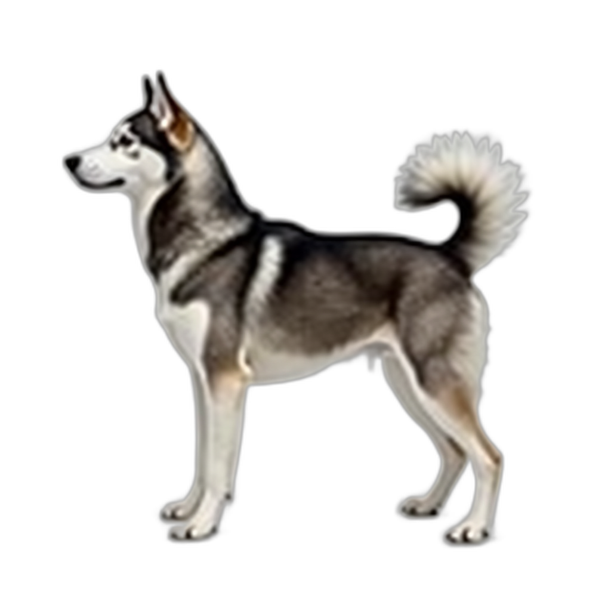
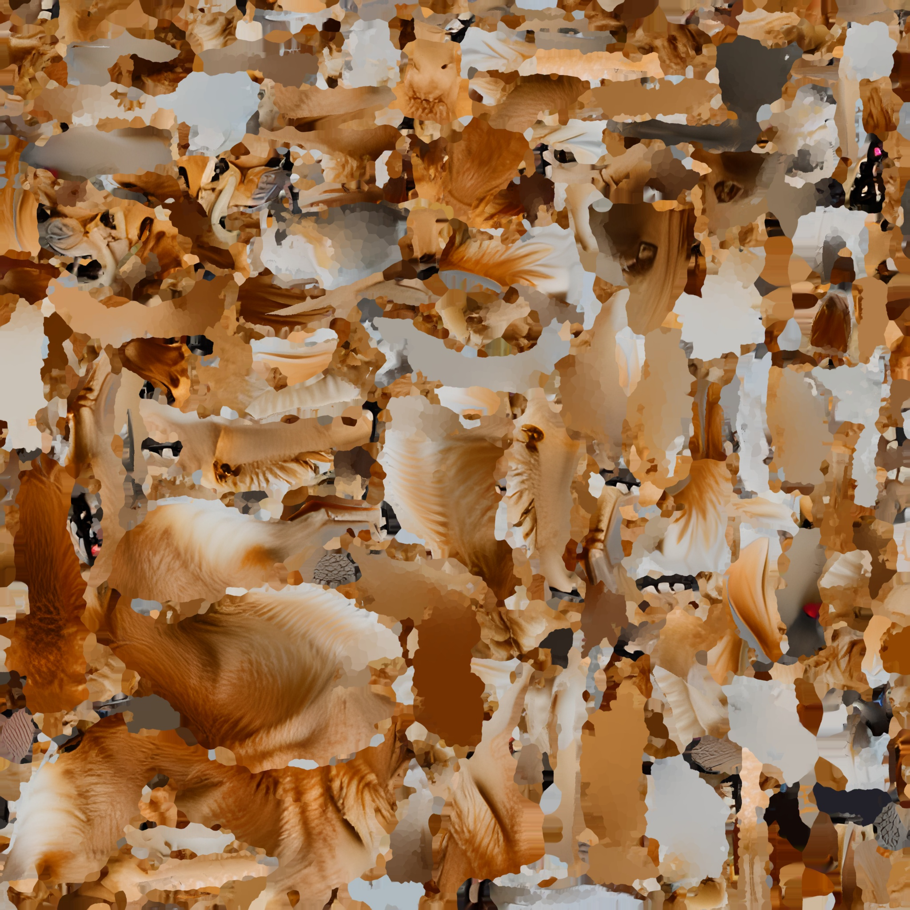
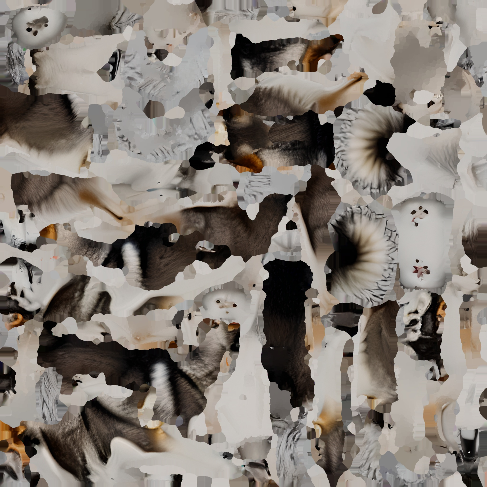
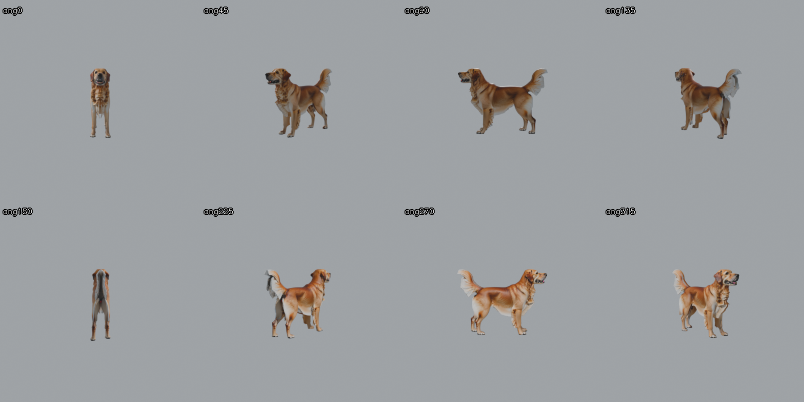
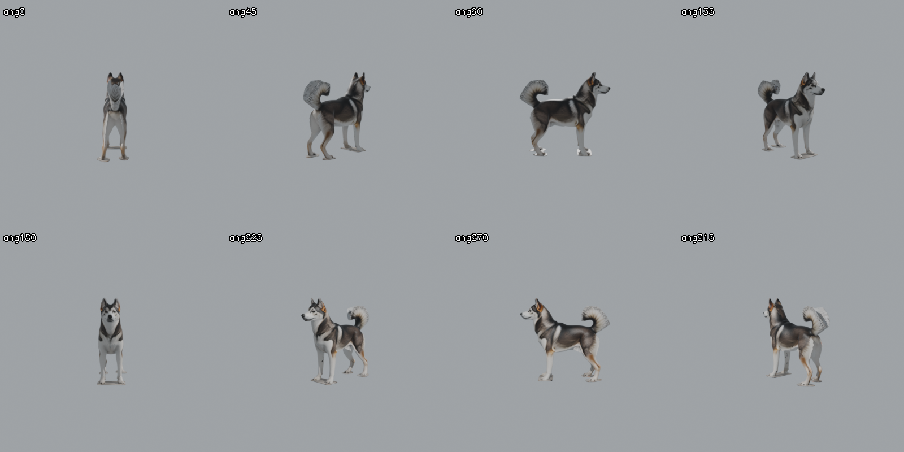

# AVEngine 端到端使用指南

> **目标读者**：拿到 AVEngine 的合作者。你 clone 完仓库、跑完 setup、装完环境后想知道 **数据是怎么一步步变成最终 4 通道视频的**，以及**哪里可以插自己的数据**。
>
> 本文档从**文字 prompt** 出发，跟着 pipeline 一路走到**带音频的 mp4**，每步都有真实产物（图片/视频）。

---

## 全流程总览图



---

## 🎬 最终产物预览

先看结果，再讲怎么做出来的。

**Shoebox 房间**（GPURIR 匹配的合成房间，纯净背景）— 哈士奇走过金毛面前，最后回头看相机：



- 视频文件：[`docs/assets/e2e/final_shoebox_view0.mp4`](assets/e2e/final_shoebox_view0.mp4)

**Apartment 房间**（SPEAR 真实公寓扫描，含餐桌/椅/边桌/台灯）— 两只狗在客厅活动，家具不穿模：



- 视频文件：[`docs/assets/e2e/final_apartment_view0.mp4`](assets/e2e/final_apartment_view0.mp4)

两个视频都是 640×480 / 15 fps / 5 s / 立体声 AAC。

---

## 阶段 ①：Flux 参考图生成

**输入**：英文 prompt（模板见下）。

**四足动物模板**（[`external/SPEAR/tools/batch_animal_pipeline.py`](../external/SPEAR/tools/batch_animal_pipeline.py) `PROMPT_TEMPLATE_QUADRUPED`）：

```
a {breed} {species} in perfect side profile view, its tail held
clearly above the horizontal at about 45 degrees upward (not vertical),
all four legs spread wide apart with visible gaps between them,
standing on a level surface, plain solid white background,
product photography, isolated on white
```

**为什么这些约束**：
- **侧视 + 白底** → Hunyuan3D 需要干净单张图重建体积
- **四腿分开** → 避免 Hunyuan 出腿间桥接面
- **尾巴 45° 上举** → rig 迁移时尾骨不会捏成一团

**产物示例**：

| tag | reference.png |
|---|---|
| dog_golden |  |
| dog_husky |  |

📁 路径：`external/SPEAR/tmp/hy3d_batch/{tag}/reference.png`

**要生成新 tag**：在 `SPECIES_LIST` 里加一行 `("cow", "holstein", PROMPT_TEMPLATE_QUADRUPED, "cow_holstein")`，然后跑 `batch_animal_pipeline.py`。

---

## 阶段 ②：Hunyuan3D-Shape（几何生成）

**输入**：`reference.png`（先 rembg 去背景 → `reference_rembg.png`）

**模型**：`Hunyuan3DDiTFlowMatchingPipeline`（本地权重 `$AVENGINE_HUNYUAN3D_WEIGHTS_DIR`）

**产物**：`shape.glb`（纯白 mesh，无贴图）

⬇ 送入 Hunyuan3D-Paint

---

## 阶段 ③：Hunyuan3D-Paint（PBR 贴图烘焙）

**输入**：`shape.glb` + `reference.png`

**包装**：[`external/SPEAR/tools/hy3d_bake_diffuse.py`](../external/SPEAR/tools/hy3d_bake_diffuse.py)

**产物**：
- `hy3d_textured.obj` — 带贴图的 mesh
- `hy3d_diffuse.jpg` — 漫反射
- `hy3d_metallic.jpg` — 金属度
- `hy3d_roughness.jpg` — 粗糙度
- `hy3d_output_mesh.glb` — GLB 打包（UE Interchange 导入用）

**贴图产物示例**：

| tag | diffuse |
|---|---|
| dog_golden |  |
| dog_husky |  |

⬇ 送入 Blender 转盘 QC

---

## 阶段 ④：Blender 转盘 QC

**目的**：花时间 rig 迁移 + UE 导入前先用 9 视角 grid 图确认 mesh 人眼可辨认。

**产物**：`turntable_grid.png`

| tag | turntable |
|---|---|
| dog_golden |  |
| dog_husky |  |

⬇ 通过 QC → 进入 rig 迁移

---

## 阶段 ⑤：Quaternius Rig 迁移（骨骼权重传递）

**目的**：Hunyuan mesh 是**无骨骼**的静态 mesh；要让它会走路，把 Quaternius 现成动物 rig（含 Walking / Idle 动画）"移植"上去。

**核心脚本**：[`external/SPEAR/tools/blender_robust_swap_mesh_keep_rig.py`](../external/SPEAR/tools/blender_robust_swap_mesh_keep_rig.py)

**源 rig 位置**：`assets/mesh_library/quaternius_animalpack/` 和 `quaternius_farm/`（AVEngine 自带 12 个 GLB, 4.6 MB）

**当前动画映射**（[`external/SPEAR/tools/species_rig_map.py`](../external/SPEAR/tools/species_rig_map.py) `ANIMATED_RIG_MAP`）：

| 目标 tag | 使用源 rig |
|---|---|
| `dog_golden`, `dog_husky` | `Dog.glb` |
| `cat_persian`, `cat_tabby`, `chipmunk` | `Cat.glb` |

**Robust 迁移 9 步**：
1. 导入源 rig GLB + Hunyuan 目标 mesh
2. 对齐 mesh 到源 rig 坐标系
3. 移除地面 patch + 低位腿间桥接
4. 语义分区：尾 / 躯干 / 头 / 前腿 L/R / 后腿 L/R
5. 只从兼容源区域传骨骼权重
6. mesh 图 inpaint 缺失权重
7. 每顶点保留 top-k 归一化权重
8. 可选压制头/尾/脚旋转
9. 导出 UE-safe GLB

⚠ **大型有蹄类**（马、牛、牦牛、驴、羊、猪）用 Quaternius farm rig（Horse.glb 等）—— 但其骨骼命名为 `FrontFoot.R` / `Tail4` 而非 `Bone.NNN`，与 `blender_robust_swap` 硬编码模板不兼容 → **这 7 类目前只以静态 mesh 出现，不走动画**。

---

## 阶段 ⑥：骨骼门槛检查

**命令**：

```bash
bash external/SPEAR/tools/gate_check_animal.sh <tag>
```

**产物**：`/tmp/gate_check_v4/<tag>_side.mp4`（Blender 侧视走路视频）

示例（Blender 出的 rig 侧视）：
- [dog_golden 走路](assets/pipeline/04_gate_dog_golden.mp4)
- [dog_husky 走路](assets/pipeline/04_gate_dog_husky.mp4)

⬇ 通过 gate check → UE 导入

---

## 阶段 ⑦：Unreal 导入 + Cook

**动画动物**：[`external/SPEAR/tools/import_gate_animal_editor.py`](../external/SPEAR/tools/import_gate_animal_editor.py)

每个 tag 生成：
- Skeletal Mesh: `/Game/MyAssets/Audioset/Meshes/gate_<tag>/`
- Blueprint: `/Game/MyAssets/Audioset/Blueprints/gate_<tag>/BP_gate_<tag>`
- SkeletalMeshComponent 默认播 `Walking` 动画

**静态动物**：[`external/SPEAR/tools/gpurir_scenes/build_static_meshes.sh`](../external/SPEAR/tools/gpurir_scenes/build_static_meshes.sh)

**Cook**：UAT 打包成 Standalone SPEAR runtime 可加载的 pak。

---

## 阶段 ⑧：场景合成 (SceneSpec)

**入口**：[`external/SPEAR/tools/gpurir_scenes/scene_spec.py`](../external/SPEAR/tools/gpurir_scenes/scene_spec.py)

**确定性场景契约**：

| 参数 | 值 |
|---|---|
| 房间尺寸 | 5.2 m × 4.4 m × 2.8 m |
| 混响时间 T60 | 0.45 s |
| 麦克风位置 | (2.6, 2.2, 1.2) m（房间中心，高 1.2m） |
| 麦克风朝向 | +Y = 窗户方向（固定） |
| 视频时长 | 5 s |
| 视频帧数 | 75 帧 @ 15 fps |
| 视频分辨率 | 640 × 480 |
| 相机水平 FoV | 120° |
| 音频采样率 | 16 kHz |
| 每场景动物数 | 1 或 2 |
| 每房间摄像机视角 | 4 个固定 yaw (0/90/180/270) |

**⚠ 关键契约**：SPEAR 用 `bTeleport=True` 逐帧传送 actor，**运行时物理碰撞被完全绕过**。所有几何合法性**在生成 SceneSpec 阶段**用代码校验：

1. **墙面 footprint 净空** —— 每帧每动物中心 + footprint 半径 vs 每面墙
2. **动物两两 clearance** —— 中心距 − r_a − r_b ≥ min_sep
3. **同帧动画 vs 动画** —— 不同时间过同一位置不算穿
4. **公寓家具 bbox** —— 从 `data/apartment_furniture_map.json` 加载 45 件家具 AABB
5. **单动物 footprint 按 tag** —— 狗 ≈ 0.45m，猫 / chipmunk 小些

**动画走姿契约**（防倒着走）：body_yaw = motion_direction + `walking_forward_yaw_offset_deg`（Quaternius = 180°）。每 tag 在 `species_rig_map.ANIMATED_RIG_MAP` 里必填该字段（否则 import-time 报错）。

**手写 two_dog demo**：[`scene_two_dogs.py`](../external/SPEAR/tools/gpurir_scenes/scene_two_dogs.py) — 金毛静止 Idle + 哈士奇 L 形路径（走→转→走→转身面朝相机）。

**随机场景**：`compose_scene(seed)` 用 seed 决定动物组合 + 轨迹，采样时避开家具，失败重试。

---

## 阶段 ⑨：视频渲染（两个房间并行）

**入口**：[`external/SPEAR/tools/gpurir_scenes/run_render_pass.py`](../external/SPEAR/tools/gpurir_scenes/run_render_pass.py)

### ⑨-A. apartment（真实公寓）
- SPEAR 原生 `apartment_0000` 地图（Kujiale 扫描）
- 45 件家具 (沙发×1、椅×10、桌×4、灯×2、门×2、壁画×3、窗×4、窗帘×2、镜×1、书架×1、抱枕×5、其它×10)
- view0 朝窗户

### ⑨-B. shoebox（GPURIR 匹配的合成房间）
- 5.2 × 4.4 × 2.8m 空房间
- 使用公寓材质实例
- **shoebox 帧渲染后水平翻转** —— 保证画面右 = 世界 +X = 音频右声道

**每房间产出**：`view0.mp4` … `view3.mp4`（均无声）

> ⚠ 原始 `view*.mp4` 是**无声的**，这是设计如此。播放请用 mux 阶段产出的 `_with_audio.mp4`。

---

## 阶段 ⑩：GPURIR 4 通道音频仿真

**入口**：[`external/SPEAR/tools/gpurir_scenes/run_audio_pass.py`](../external/SPEAR/tools/gpurir_scenes/run_audio_pass.py)

**每动物声源**：
1. **audio_registry 选源**：优先本地 OmniAudio (`$AVENGINE_AUDIO_CORPUS` 下 58k .wav) 按关键词匹配；找不到用 Stable Audio Open 1.0 兜底
2. **规范化**：单通道，16 kHz，5 s。长片段裁剪，短片段静音补齐，**不循环**
3. **模拟 4 胶囊四面体麦克风**：中心 (2.6, 2.2, 1.2) m，胶囊半径 0.042 m
4. **gpuRIR 房间脉冲响应**：移动动物用 `simulateTrajectory`（逐帧 RIR），静态用单次卷积。T60=0.45s (Sabine 估计)
5. **多源混合 + 峰值归一化到 0.9**

**产物**：`audio.wav`，shape `80000 × 4`

---

## 阶段 ⑪：音视频 Mux

**入口**：[`external/SPEAR/tools/gpurir_scenes/mux_audio_video.py`](../external/SPEAR/tools/gpurir_scenes/mux_audio_video.py)

1. **4 通道 → 立体声**：`FL = 0.5·c0 + 0.5·c2`, `FR = 0.5·c1 + 0.5·c3`
2. **ffmpeg mux** 立体声 WAV 到每个 view*.mp4，AAC 编码

**产物**：`view0_with_audio.mp4` … `view3_with_audio.mp4`

> ✅ **播放请用 `_with_audio.mp4`**

---

## 🚀 端到端一键脚本

**手写 two_dogs demo**（保证有输出）：

```bash
cd /path/to/AVEngine
conda activate spear-env
export DISPLAY=:99
export VK_ICD_FILENAMES=/usr/share/vulkan/icd.d/nvidia_icd.json
python external/SPEAR/tools/gpurir_scenes/scene_two_dogs.py
# 无 --skip-audio 会跑完整 audio pass；有 --skip-audio 复用旧 audio.wav
```

产物落在：`external/SPEAR/tmp/gpurir_scenes_v1/two_dogs/{apartment,shoebox}/view*_with_audio.mp4`

**随机 seeded 场景**：

```bash
python external/SPEAR/tools/gpurir_scenes/run_scene.py --seed 42
```

**批量 10 seeds**：

```bash
python external/SPEAR/tools/gpurir_scenes/run_all_scenes.py --seeds 0 1 2 3 4 5 6 7 8 9
```

---

## 📁 输出目录结构

```
external/SPEAR/tmp/gpurir_scenes_v1/scene_XX/
├── trajectory.json          # 轨迹 + 朝向 metadata（可当训练标签）
├── audio.wav                # 4 通道 GPURIR 输出
├── audio_stereo.wav         # 立体声下混（mux 用）
├── apartment/
│   ├── view0.mp4            # 无声原始
│   ├── view0_with_audio.mp4 # ← 播放/训练用
│   └── ...
└── shoebox/
    ├── view0.mp4
    ├── view0_with_audio.mp4
    └── ...
```

---

## 🧩 各阶段"我想改数据"的入口

| 想改的东西 | 改哪里 |
|---|---|
| **加新动物 tag** | `external/SPEAR/tools/batch_animal_pipeline.py` `SPECIES_LIST` |
| **改 Flux prompt 措辞** | 同上 `PROMPT_TEMPLATE_*` |
| **换 rig 家族** | `external/SPEAR/tools/species_rig_map.py` `ANIMATED_RIG_MAP` + 必填 `walking_forward_yaw_offset_deg` |
| **房间尺寸** | `external/SPEAR/tools/gpurir_scenes/scene_spec.py` `ROOM_SIZE_M` |
| **T60 / mic 位置** | 同上 |
| **视频分辨率 / FoV** | `external/SPEAR/tools/gpurir_scenes/run_render_pass.py` `WIDTH/HEIGHT/CAMERA_FOV_DEG` |
| **AudioSet 关键词映射** | `external/SPEAR/tools/gpurir_scenes/audio_registry.py` `TAG_TO_KEYWORDS` |
| **外部数据集绝对路径** | `paths.yaml`（顶层）|
| **手写新场景（不用 seed）** | 参考 `scene_two_dogs.py` 复制一份改常量 |

---

## 🔧 常见坑（Troubleshooting）

见 [`docs/troubleshooting.md`](troubleshooting.md)。最常踩的：

1. **conda 用错 env** — 必须 `conda activate spear-env`，不要用 `thu`
2. **`DISPLAY=:99` 忘 export** — UE 需要 X server
3. **`spear_ext` 编译失败** — 必须用 UE 自带 clang-18，不能用系统 gcc
4. **`apartment_furniture_map.json` missing** — SPEAR 必须 ≥ commit `bc8ce323`
5. **哈士奇倒着走** — `walking_forward_yaw_offset_deg` 忘设 180

---

## 🗺️ 场景理解 cheat sheet

| Feature | 路径 |
|---|---|
| Pipeline 主入口 | `external/SPEAR/tools/gpurir_scenes/` |
| 家具碰撞地图 | `external/SPEAR/data/apartment_furniture_map.json` |
| 12 个 Quaternius rig | `assets/mesh_library/` |
| Setup 一键 | `scripts/setup.sh` |
| Paths 集中管理 | `paths.yaml` |
| 完整规范 | `docs/superpowers/specs/2026-07-06-avengine-monorepo-design.md` |
| 完整实现 plan | `docs/superpowers/plans/2026-07-06-avengine-monorepo.md` |
