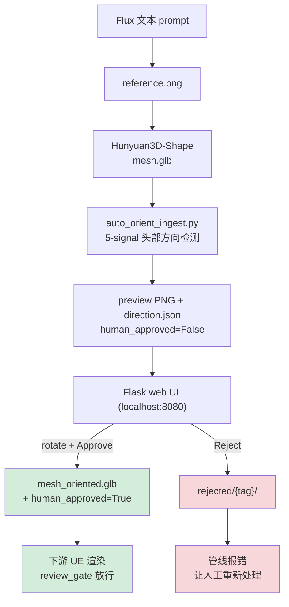

# Hunyuan 3D Mesh 方向审核流程 (Plan 1.5.A)

> **目标读者**: 你刚跑完 Hunyuan3D 生成了若干新动物 mesh,想让它们进入 SPEAR 渲染管线,又不希望半夜 debug "dog 的头指向了后面" 这种问题。
>
> 本文档描述 **trust-but-verify** 审核流程 —— 算法自动检测方向,人工在浏览器里一键确认或旋转纠正,通过后下游 UE 渲染自动放行,不通过则渲染门直接拒绝并给出可操作的报错。

---

## 为什么需要审核

Hunyuan3D-Shape 出来的 mesh **不保证头部指向任何固定方向** —— 有的头朝 +X,有的朝 -Z,有的甚至侧躺(dorsal 面不朝 +Y)。SPEAR 的动物 rig 假设的 canonical 坐标是 **头 → +X,背 → +Y 上,身长沿 X 轴**。如果 mesh 方向不对而不审核就走渲染,得到的会是"狗背对镜头走"、"猫躺着漂浮"这类难 debug 的错误。

审核确保三件事:
1. **mesh 站立方向对**:dorsal 面朝上(+Y)
2. **头部方向对**:头指向 +X
3. **有人工签名**:downstream 拿到时 `human_approved: true`,出错能追溯

---

## 目录约定

所有 audit 状态在 `external/SPEAR/tmp/hy3d_batch/` 下(git-ignored):

```
tmp/hy3d_batch/
  pending/{tag}/       ← 自动检测完,等待人工审核
    mesh.glb                    Hunyuan 原始 mesh
    mesh_current.glb            当前累积旋转后的 mesh (给 UI 用)
    direction.json              detection 结果 + 审核状态
    direction_preview_review.png 4 视图渲染 (给人工看)
    rotation.json               当前累积旋转矩阵 + history
  approved/{tag}/      ← 人工确认过,下游可用
    mesh_oriented.glb           已烘焙人工旋转的最终 mesh (canonical 方向)
    direction.json              human_approved: true
  rejected/{tag}/      ← 人工拒绝
    direction.json              human_approved: false + reason
```

---

## 全流程



---

## 第 1 步 —— 生成 mesh 并触发审核

有 3 种进入方式,任选:

### 方式 A: 一键 driver (推荐,新 rig 从 prompt 开始)

编辑 `external/SPEAR/tools/spike_rlr/hy3d_generate_and_audit.py` 里的 `NEW_RIGS` 列表,添加要生成的 (tag, species, breed, seed) —— 例如:

```python
NEW_RIGS = [
    {"tag": "dog_beagle", "species": "dog", "breed": "beagle", "seed": 4001},
    {"tag": "cat_british_shorthair", "species": "cat", "breed": "british shorthair", "seed": 4002},
]
```

然后:

```bash
cd /data/jzy/code/AVEngine/external/SPEAR
/data/jzy/miniconda3/envs/hunyuan3d/bin/python \
    tools/spike_rlr/hy3d_generate_and_audit.py
```

driver 会:
1. Flux 从 prompt 生成 reference PNG (~40 s/图)
2. Hunyuan3D-Shape 生成 .glb (~90 s/mesh)
3. copy 到 `pending/{tag}/mesh.glb`
4. 跑 `auto_orient_ingest.py` 检测头部方向 + 生成 preview
5. 打印审核指令

### 方式 B: 已有 mesh,只跑审核

如果 mesh 已经在别处生成了,只想走审核:

```bash
# 把 mesh 手动放到 pending/
mkdir -p external/SPEAR/tmp/hy3d_batch/pending/my_new_dog
cp /path/to/your.glb  external/SPEAR/tmp/hy3d_batch/pending/my_new_dog/mesh.glb

# 跑 ingest
/data/jzy/miniconda3/envs/ss2/bin/python \
    external/SPEAR/tools/spike_rlr/auto_orient_ingest.py \
    --pending-dir external/SPEAR/tmp/hy3d_batch/pending
```

### 方式 C: 补审核 Plan 1 遗留 rig

Plan 1 的 `dog_golden` / `dog_husky` 是绕过 gate 存在的。要补审核:

```bash
for tag in dog_golden dog_husky; do
    mkdir -p external/SPEAR/tmp/hy3d_batch/pending/$tag
    cp -n external/SPEAR/tmp/hy3d_batch/$tag/hy3d_output_mesh.glb \
          external/SPEAR/tmp/hy3d_batch/pending/$tag/mesh.glb
done
/data/jzy/miniconda3/envs/ss2/bin/python \
    external/SPEAR/tools/spike_rlr/auto_orient_ingest.py \
    --pending-dir external/SPEAR/tmp/hy3d_batch/pending
```

---

## 第 2 步 —— 启动审核 UI

**服务器端**:

```bash
/data/jzy/miniconda3/envs/ss2/bin/python \
    /data/jzy/code/AVEngine/external/SPEAR/tools/spike_rlr/review_ui_server.py \
    --port 8080
```

**本地 (你的笔记本) 端** —— SSH 端口转发:

```bash
ssh -N -L 8080:localhost:8080 <your-server-host>
```

然后浏览器打开 [http://localhost:8080/](http://localhost:8080/) 即可,会自动跳到第一个待审核 tag。

---

## 第 3 步 —— 审核操作

打开页面看到:

```
┌─────────────────────────────────────┐
│  Pending: 4  Approved: 0  Rejected: 0 │
├─────────────────────────────────────┤
│               dog_beagle              │
│  Auto-detected head: [+0.99, +0.08, +0.00] │
│  Confidence: 100%                     │
│                                       │
│  ┌─────────┬─────────┐               │
│  │ Isometric│ Side    │               │
│  │  🐕 →     │  🐕 →   │  ← 4 视图    │
│  │ (GREEN arrow → HEAD)│              │
│  ├─────────┼─────────┤               │
│  │ Top-down│ Front   │               │
│  └─────────┴─────────┘               │
│                                       │
│  [Roll ±90°]  [Yaw ±90°]  [Pitch ±90°]│
│  [Flip head↔tail]  [Reset]           │
│                                       │
│  [✅ Approve] [❌ Reject] [⏭ Skip]   │
└─────────────────────────────────────┘
```

### 审核任务

对每个 tag,你的任务是**让 mesh 对齐两个大参考箭头**:

- **绿色 "HEAD →" 箭头**指向 world +X → **动物的头应该指这个方向**
- **蓝色 "UP ↑" 箭头**指向 world +Y → **动物应该站立**(dorsal 面朝上)

如果 Hunyuan 出来的 mesh 已经这样了 —— 直接点 **Approve**。

如果不对 —— 用旋转按钮调:

| 情况 | 用哪个按钮 |
|---|---|
| 头指向反方向 (mesh 头指 -X) | **Flip head↔tail** (180° yaw) |
| 头指向 +Y (还需转 90° 到 +X) | **Yaw −90°** |
| 头指向 +Z | **Pitch ±90°** |
| 侧躺 (dorsal 朝 +X 而不是 +Y) | **Roll ±90°** |
| 头朝下 (dorsal 朝 -Y) | **Roll ±90° × 2** 或 **Pitch ±90°** |
| 完全无法辨认 / mesh 坏了 | **Reject** |
| 暂时看不清,先跳过下次再看 | **Skip** |
| 转错了想重来 | **Reset** |

每按一次旋转按钮,页面立即重新渲染 preview,累积的旋转会显示在 confidence 行:

```
Confidence: 100% | Applied rotation: y+90 + x+90
```

### 决策后

- **Approve** → mesh 移到 `approved/{tag}/`,`direction.json` 加 `human_approved: true` + 你的累积旋转历史 + 你的 username;浏览器**自动跳下一个** pending tag
- **Reject** → mesh 移到 `rejected/{tag}/`,`human_approved: false`;跳下一个
- **Skip** → 保留在 `pending/`,跳下一个
- 所有 tag 都审完 → 页面变成 "🎉 All pending meshes reviewed"

---

## 第 4 步 —— 下游 UE 渲染自动放行

审核完的 rig 现在可以进 UE 渲染。SPEAR 的 `run_render_pass_apartment.py` 在 spawn actor **之前**会调 `review_gate.assert_mesh_approved(tag)`:

- Tag 在 `approved/` 且 `human_approved=true` → **静默放行**,继续渲染
- Tag 不在 `approved/` → 立即 raise `MeshNotApprovedError`,并给出可操作错误信息:

  ```
  Tag 'dog_beagle' not found in approved/ (tmp/hy3d_batch/approved/dog_beagle/direction.json).
  To fix: run the auto_orient_ingest pipeline on the source mesh,
  then start review_ui_server.py and approve it in the browser.
  ```

- Tag 在 `approved/` 但 `human_approved=false` → raise + 指令 "start review UI 点 Approve"
- 算法版本不匹配 (auto_orient_v0 vs 当前 v1) → raise + "re-run auto_orient_ingest --force"

### 应急旁路 (仅在紧急调试时使用)

对于 Plan 1 的遗留 rig 不想强制走审核:

```bash
SPEAR_SKIP_REVIEW_GATE=1 python tools/spike_rlr/run_render_pass_apartment.py ...
```

**警告**: 生产 dataset 生成 (Plan 2 `dataset_runner.py`) **不设**这个 flag,所以任何进入 M1/M2 dataset 的 rig 必须走审核。

---

## 附录 A — direction.json schema

```json
{
  "mesh_source": "tmp/hy3d_batch/pending/dog_beagle/mesh.glb",
  "mesh_oriented": "tmp/hy3d_batch/pending/dog_beagle/mesh_oriented.glb",
  "algorithm_version": "auto_orient_v1",
  "detected_at": "2026-07-08T...Z",
  "detection": {
    "head_direction_original_mesh_frame": [0.98, 0.05, -0.19],
    "rotation_applied_to_align_to_plus_x": [[...], [...], [...]],
    "signals": {"leg_spacing_vote": 3, "high_verts_vote": 2, "mass_end_vote": 1},
    "total_votes": 6,
    "unanimous": true,
    "confidence": 0.95
  },
  "human_approved": true,
  "human_approved_by": "jzy",
  "human_approved_at": "2026-07-08T...Z",
  "human_notes": null,
  "human_applied_rotation_matrix": [[...], [...], [...]],
  "human_applied_rotation_history": ["y+90", "x-90"],
  "quarantined": false
}
```

## 附录 B — 涉及的 Python 模块

| 文件 | 职责 |
|---|---|
| `tools/spike_rlr/hy3d_generate_and_audit.py` | 一键 Flux + Hunyuan3D + ingest 驱动 |
| `tools/spike_rlr/auto_orient_ingest.py` | 检测头部方向,写 direction.json + preview |
| `tools/spike_rlr/detect_head_axis.py` | 5-signal 头部方向检测算法 (PCA + KMeans) |
| `tools/spike_rlr/preview_render.py` | 生成 4 视图 PNG (`render_review_preview` for the UI) |
| `tools/spike_rlr/review_ui_server.py` | Flask web UI (single-card + rotate buttons) |
| `tools/spike_rlr/review_gate.py` | 下游 `assert_mesh_approved()` 门 |
| `tools/hy3d_batch/README.md` | 目录约定简要说明 |

## 附录 C — 常见问题

**Q: 为什么审核的是"裸几何"而不是带贴图的动画视频?**

A: 审核动画正确性 = mesh 头部方向(1.5.A)+ rig 骨骼偏移(1.5.B)+ 房间坐标系(1.5.D)三者叠加。一次只审一件事才能定位问题。骨骼偏移由 `rig_direction_check.py` 用 bone-query 自动断言,不需人工。房间坐标由 `test_room_conventions.py` 单元测试自动断言。

**Q: 我 UI 里改的旋转,下游 rig 绑骨会自动跟上吗?**

A: 会。审核 Approve 时,你的累积旋转直接烘焙进 `mesh_oriented.glb` 的顶点坐标。下游 `robust_skin_transfer.py` / `blender_swap` 读的是这个 canonical mesh,得到的绑骨自然是对齐的。

**Q: 算法 confidence 100% + unanimous 我还需要看吗?**

A: 建议看一眼。合成 fixture 上 unanimity ≠ 真实 mesh 正确,只代表 5 个 signal 意见一致。如果 Hunyuan 生成了个头尾很对称的形状(比如某些鱼、蛇),几何 signal 可能一致但方向仍是随机的。

**Q: 我可以批量 Approve 吗?**

A: 目前 UI 是一个一个来的(强制每个 mesh 你至少看一眼)。如果你有几百个 mesh 要审核,可以直接编辑 `pending/{tag}/direction.json` 把 `human_approved` 设 true 然后手动 mv 到 `approved/` —— 但这样就不叫审核了,是自己给自己签保票。

**Q: 服务器上跑不了 GUI/浏览器,怎么审?**

A: 用 SSH 端口转发到你本地的浏览器(见第 2 步)。整个 UI 依赖的只是 HTML/CSS/PNG,server 端不需要显示器。matplotlib 用的是 Agg 后端,同样不需要 GUI。

---

## 项目根级快捷启动脚本

```bash
# 一键启动 UI (默认 pending / approved / rejected 都在 external/SPEAR/tmp/hy3d_batch/ 下)
/data/jzy/miniconda3/envs/ss2/bin/python \
    /data/jzy/code/AVEngine/external/SPEAR/tools/spike_rlr/review_ui_server.py \
    --port 8080

# 本地转发
# ssh -N -L 8080:localhost:8080 <this-server>
# open http://localhost:8080/
```
