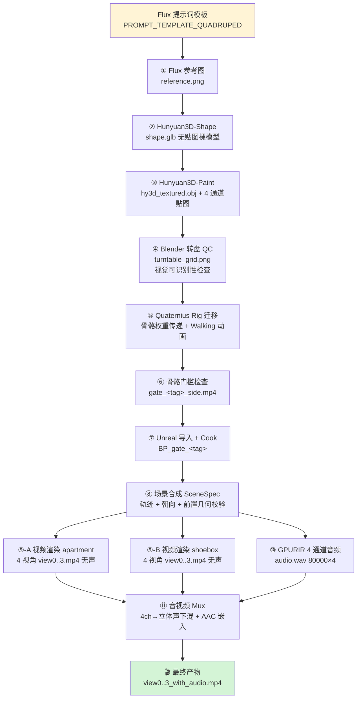
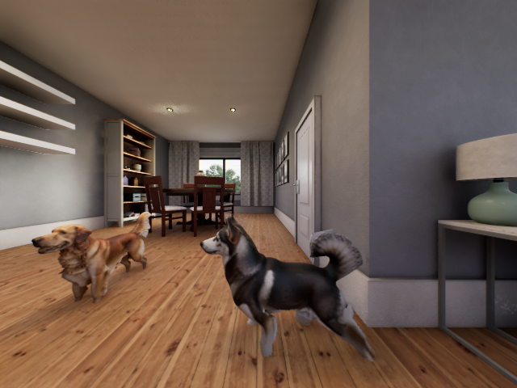
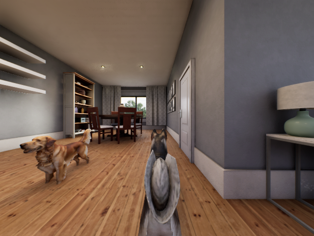
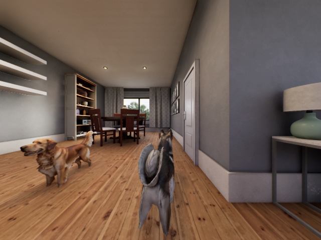
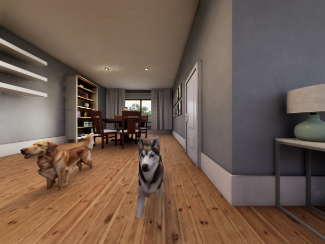

# 动物 4 通道音视频数据集构造全流程（图文版）

> 快照日期：2026-07-06
>
> 本文档从 **Flux 提示词** 开始，一路串到 **最终带音频的 4 通道 MP4**，
> 每个阶段都放实际产物（图片/视频）。飞书直接支持 Mermaid 代码块渲染。
>
> 演示 tag：**dog_golden**（金毛）+ **dog_husky**（哈士奇）

---

## 0. 全流程总览图



---

## 阶段 ①：Flux 参考图生成

**输入**：一句英文提示词（模板见下），种子固定。

**四足动物模板**（`tools/batch_animal_pipeline.py::PROMPT_TEMPLATE_QUADRUPED`）：

```text
a {breed} {species} in perfect side profile view, its tail held
clearly above the horizontal at about 45 degrees upward (not vertical),
all four legs spread wide apart with visible gaps between them,
standing on a level surface, plain solid white background,
product photography, isolated on white
```

**鸟类模板**（`PROMPT_TEMPLATE_BIRD`）：

```text
a {breed} {species} in perfect side profile view, wings tucked at
sides but slightly separated from body, tail feathers held clearly
away from the body horizontally, both legs visible and apart, standing
upright, plain solid white background, product photography,
isolated on white
```

**小型四足模板**（`PROMPT_TEMPLATE_SMALL_QUADRUPED`）：

```text
a {breed} {species} in perfect side profile view, tail held clearly
up and away from the body, all four legs visible and separated,
standing on a level surface, plain solid white background, product
photography, isolated on white
```

> 关键点：这些约束（**侧视 / 白底 / 四腿分开 / 尾巴不贴身**）不只是为了图片好看，而是**为下游 Hunyuan 建模和 rig 迁移服务**。腿贴一起会让 Hunyuan 出腿间桥接面；尾贴身会导致 rig 骨骼权重错误。

**Flux 生成器**：`tools/flux_generate_reference.py`

**产物示例**（tag = `dog_golden`, `dog_husky`）：


📁 实际路径：
- `/data/jzy/code/SPEAR/tmp/hy3d_batch/dog_golden/reference.png`
- `/data/jzy/code/SPEAR/tmp/hy3d_batch/dog_husky/reference.png`

⬇ **箭头**：`reference.png` 送入 Hunyuan3D-Shape

---

## 阶段 ②：Hunyuan3D-Shape（形状生成）

**输入**：`reference.png`（Flux 出的侧视图，先经背景抠除得到 `reference_rembg.png`）

**模型**：`Hunyuan3DDiTFlowMatchingPipeline`（本地权重 `/data/jzy/code/Hunyuan3D-2.1/pretrained_models`）

**产物**：`shape.glb`（无贴图裸模型 mesh）

> 阶段 ② 只出几何形状，没有颜色/贴图，主要用于验证 mesh 合法性、拓扑连通性。视觉上是纯白 mesh。

⬇ **箭头**：`shape.glb` 送入 Hunyuan3D-Paint

---

## 阶段 ③：Hunyuan3D-Paint（PBR 贴图烘焙）

**输入**：`shape.glb` + `reference.png`

**包装脚本**：`tools/hy3d_bake_diffuse.py`

**产物**：
- `hy3d_textured.obj` — 带贴图的最终 mesh
- `hy3d_diffuse.jpg` — 漫反射贴图（下面展示）
- `hy3d_metallic.jpg` — 金属度贴图
- `hy3d_roughness.jpg` — 粗糙度贴图
- `hy3d_output_mesh.glb` — GLB 打包版（供 UE Interchange 导入用）

**贴图产物示例**：


📁 实际路径：`/data/jzy/code/SPEAR/tmp/hy3d_batch/{tag}/hy3d_diffuse.jpg`

⬇ **箭头**：`hy3d_textured.obj` 送入 Blender 转盘 QC

---

## 阶段 ④：Blender 转盘视觉可识别性 QC

**目的**：在花时间做 rig 迁移和 UE 导入之前，先用一张 3×3 grid 的转盘图确认 Hunyuan mesh 是"人眼可识别"的动物，而不是奇形怪状的一坨。

**产物**：`turntable_grid.png`（9 个角度的渲染拼图）

**示例**：


📁 实际路径：`/data/jzy/code/SPEAR/tmp/hy3d_batch/{tag}/turntable_grid.png`

⬇ **箭头**：QC 通过 → 进入 rig 迁移

---

## 阶段 ⑤：Quaternius Rig 迁移（骨骼权重传递）

**目的**：Hunyuan 生成的是**无骨骼**的 static mesh。要让它会走路，得把 Quaternius 现成的动物 rig（有 Walking / Idle / Run 动画）"移植"到 Hunyuan 的形状上。

**核心脚本**：`tools/blender_robust_swap_mesh_keep_rig.py`

**源 rig 位置**：`/data/jzy/code/Spatial/v77_4ch_S2L/assets/mesh_library/quaternius_animalpack/`

**当前动画映射**（`tools/species_rig_map.py::ANIMATED_RIG_MAP`）：

| 目标 tag | 使用源 rig |
|---|---|
| `dog_golden`, `dog_husky` | `Dog.glb` |
| `cat_persian`, `cat_tabby`, `chipmunk` | `Cat.glb` |

**Robust 迁移策略（9 步）**：

1. 导入源 rig GLB 与 Hunyuan 目标 mesh
2. 对齐目标 mesh 到源 rig 坐标系（scale / center / rotate）
3. 移除地面 patch 和低位腿间桥接面（Hunyuan 常见 artifact）
4. 将目标 mesh 分割为语义区域：**尾巴 / 躯干 / 头 / 前腿左右 / 后腿左右**
5. **只从兼容的源区域**传递骨骼权重（避免手臂骨骼把尾巴当皮驱动）
6. 通过 mesh 图结构 inpaint 缺失权重
7. 每顶点保留 top-k 归一化骨骼权重
8. 可选：压制头/尾/脚旋转以减少怪异动作
9. 导出 UE-safe GLB，保留源 rig 的所有动画

**产物**：`/tmp/gate_check_v4/<tag>_rigged.glb`（带 rig 的 GLB）

> ⚠ 大型有蹄类（马、牛、牦牛、驴、山羊、绵羊、猪）：Quaternius farm rig 用**语义骨骼名**（`FrontFoot.R`, `Tail4`），与 `blender_robust_swap` 硬编码的 `Bone.NNN` 模板不兼容，暴力迁移会得到断裂动画。**当前解决方案：这 7 类只以静态 mesh 参与场景，不走动画。**

⬇ **箭头**：rig 迁移后的 GLB 进入门槛检查

---

## 阶段 ⑥：骨骼门槛检查（gate check）

**目的**：验证 rig 迁移的动画在 mesh 上"跑得起来"。用 Blender 无头模式渲染一段侧视走路视频。

**命令**：

```bash
bash tools/gate_check_animal.sh <tag>
```

**产物**：`/tmp/gate_check_v4/<tag>_side.mp4`

**示例视频（gate check 走路）**：

- `dog_golden` 走路：`docs/assets/pipeline/04_gate_dog_golden.mp4`
- `dog_husky` 走路：`docs/assets/pipeline/04_gate_dog_husky.mp4`

> 这些 gate check 视频在飞书里以附件形式插入即可播放。

⬇ **箭头**：通过 gate check 后进入 UE 导入

---

## 阶段 ⑦：Unreal 导入与 Cook

**动画动物导入**：`tools/import_gate_animal_editor.py`

每个 animated tag 会在 UE 项目里生成：

- Skeletal Mesh：`/Game/MyAssets/Audioset/Meshes/gate_<tag>/`
- Blueprint：`/Game/MyAssets/Audioset/Blueprints/gate_<tag>/BP_gate_<tag>`
- SkeletalMeshComponent 默认播放 `Walking` 动画

**静态动物导入**：`tools/gpurir_scenes/build_static_meshes.sh`

- StaticMesh：`/Game/MyAssets/Audioset/Meshes/gate_static_<tag>/`
- Blueprint：`.../BP_gate_static_<tag>`

**Cook**：通过 UAT 包装脚本 cook，让 Standalone SPEAR runtime 可加载。

⬇ **箭头**：所有 BP 打包完成 → 场景可以用它们了

---

## 阶段 ⑧：场景合成 SceneSpec

**入口**：`tools/gpurir_scenes/scene_spec.py`

**确定性场景契约**：

| 参数 | 值 |
|---|---|
| 房间尺寸 | 5.2 m × 4.4 m × 2.8 m |
| 混响时间 T60 | 0.45 s |
| 麦克风位置 | (2.6, 2.2, 1.2) m（房间中心，高 1.2m） |
| 麦克风朝向 | +Y = 窗户方向（固定不变） |
| 视频时长 | 5 s |
| 视频帧数 | 75 帧 @ 15 fps |
| 视频分辨率 | 640 × 480 |
| 相机水平 FoV | 120° |
| 音频采样率 | 16 kHz |
| 每场景动物数 | 1 或 2 |
| 每房间摄像机视角 | 4 个固定 yaw (0/90/180/270) |

**⚠ 为什么必须在生成阶段做几何校验？**

SPEAR 用 `AlwaysSpawn` + `bTeleport=True` 逐帧传送 actor，**运行时物理碰撞被完全绕过**。因此几何合法性只能在**生成 SceneSpec 时用代码校验**：

1. **墙面 footprint clearance** — 每帧每动物中心 + footprint 半径 vs 每面墙
2. **动物两两 clearance** — 中心距 − r_a − r_b ≥ 最小间隙
3. **动画 vs 动画只查同帧** — 不同时间经过同一位置不算穿模
4. **单动物 footprint 半径按 tag 定** — 狗 ≈ 0.45m，猫/chipmunk 更小
5. **找不到合法轨迹时回退**：局部小范围往复轨迹；仍放不下则降级为单动物场景

**手写 two_dog demo**：`tools/gpurir_scenes/scene_two_dogs.py`
- 金毛：静止在 (1.10, 3.65)，播 Idle 动画，面朝相机
- 哈士奇：L 形路径（走→转 90°→走→转身面朝相机），全程在走廊中线内
- 额外走廊约束：`x ≤ 2.85m` 避免贴公寓右侧门框

⬇ **箭头**：SceneSpec 校验通过 → 分别送入视频渲染 + 音频仿真

---

## 阶段 ⑨：视频渲染（两个房间并行）

**入口**：`tools/gpurir_scenes/run_render_pass.py`

**支持两种视觉房间**：

### ⑨-A. apartment（真实公寓地图）

- 使用 SPEAR 原生 `apartment_0000` 地图
- SceneSpec 坐标映射到公寓本地麦克风锚点
- view0 朝公寓窗户方向

**产物**：`view0.mp4`, `view1.mp4`, `view2.mp4`, `view3.mp4`（**均无声**）

### ⑨-B. shoebox（GPURIR 匹配的合成房间）

- 匹配 GPURIR 尺寸的合成房间
- 使用公寓的地板/墙面材质实例
- **shoebox 帧渲染后水平翻转** —— 保证 **画面右 = 世界 +X = 音频右声道**

**产物**：同样 4 个 view*.mp4（**均无声**）

> ⚠ **原始 `view*.mp4` 是无声的，这是设计如此。** 播放时必须用 mux 阶段产出的 `_with_audio.mp4`。

**apartment 主视角 view0 关键帧**（v19 two_dogs）：

**frame 12** — 哈士奇进入画面：


**frame 37** — 两只狗都可见，哈士奇 90° 转弯后向前走：


**frame 60** — 哈士奇走到画面中央位置：


**frame 74** — 结束帧：


📁 实际路径：`/data/jzy/code/SPEAR/tmp/gpurir_scenes_v19/two_dogs/apartment/view0_frame_XXXX.png`

⬇ **箭头**：无声 mp4 → 送入 mux

---

## 阶段 ⑩：GPURIR 4 通道音频仿真

**入口**：`tools/gpurir_scenes/run_audio_pass.py`

**处理流程**（对每个动物声源）：

1. **通过 `audio_registry.py` 选源片段**
   - 优先从 OmniAudio 本地库 (`/data/datasets/omniaudio/train-data-az-360-large`) 按关键词匹配 wav
   - 找不到时用 Stable Audio Open 1.0 兜底生成

2. **规范化为单通道、16 kHz、5 s**
   - 长片段裁剪，短片段静音补齐，**不循环**

3. **模拟 4 胶囊四面体麦克风**
   - 中心：(2.6, 2.2, 1.2) m
   - 胶囊半径：0.042 m

4. **gpuRIR 房间脉冲响应**
   - 移动动物：`gpuRIR.simulateTrajectory`（逐帧移动的 RIR 更新）
   - 静态动物：单次静态 RIR 卷积
   - T60 = 0.45s（Sabine 估计）

5. **多源混合 + 峰值归一化到 0.9**

**产物**：`audio.wav`，形状 **`80000 samples × 4 channels`**（5 s × 16 kHz × 4 声道）

📁 实际路径：`/data/jzy/code/SPEAR/tmp/gpurir_scenes_v19/two_dogs/audio.wav`

⬇ **箭头**：4 通道 wav → 送入 mux

---

## 阶段 ⑪：音视频合成 (Mux)

**入口**：`tools/gpurir_scenes/mux_audio_video.py`

**执行**：

1. **4 通道四面体下混为立体声**：
   - `FL = 0.5·c0 + 0.5·c2`
   - `FR = 0.5·c1 + 0.5·c3`

2. **将立体声 WAV 用 ffmpeg mux 到每个渲染 MP4**（AAC 编码）

**产物**：
- `view0_with_audio.mp4` ← **最终可播放**
- `view1_with_audio.mp4`
- `view2_with_audio.mp4`
- `view3_with_audio.mp4`
- `audio_stereo.wav`（中间产物）

> 📢 **播放或人工校审时，必须用 `_with_audio.mp4`，不要用原始 `view*.mp4`。**

---

## 🎬 最终产物示例

**apartment view0（金毛静止 + 哈士奇 L 形轨迹）**：

- 视频文件：`docs/assets/pipeline/06_final_view0.mp4`
- 属性：640 × 480, 75 帧, 5.0s, h264 + stereo AAC
- 音量：mean ≈ −18.2 dB, max ≈ −1.7 dB（非静音）

📁 完整 4 视角在：
```
/data/jzy/code/SPEAR/tmp/gpurir_scenes_v19/two_dogs/apartment/
├── view0_with_audio.mp4    ← 主视角（面朝窗户）
├── view1_with_audio.mp4
├── view2_with_audio.mp4
└── view3_with_audio.mp4
```

---

## 输出目录结构

```text
tmp/gpurir_scenes_v*/scene_XX/
├── trajectory.json          # 轨迹 + 朝向 metadata（可用于回放/训练标注）
├── audio.wav                # 4 通道 GPURIR 输出
├── audio_stereo.wav         # 立体声下混（mux 用）
├── apartment/
│   ├── view0.mp4            # 无声原始
│   ├── view0_with_audio.mp4 # ← 播放/训练用
│   └── ...
└── shoebox/
    ├── view0.mp4
    ├── view0_with_audio.mp4
    └── ...
```

---

## 端到端一键脚本

**随机 seeded 场景**：

```bash
/data/jzy/miniconda3/envs/spear-env/bin/python \
  tools/gpurir_scenes/run_scene.py \
  --seed <seed> \
  --out-root /data/jzy/code/SPEAR/tmp/gpurir_scenes_v1
```

**手写 two_dogs demo**：

```bash
/data/jzy/miniconda3/envs/spear-env/bin/python \
  tools/gpurir_scenes/scene_two_dogs.py \
  --out-root /data/jzy/code/SPEAR/tmp/gpurir_scenes_v1
```

---

## 当前已知限制

| # | 限制 | 处理策略 |
|---|---|---|
| 1 | 原始 `view*.mp4` 无声 | 用 `_with_audio.mp4` 播放 |
| 2 | Teleport 移动不触发运行时物理碰撞 | 生成阶段做 footprint + 同帧 clearance 前置校验 |
| 3 | 只有 5 类有走路动画（狗×2、猫×2、chipmunk） | 大型有蹄类当静态源使用 |
| 4 | 公寓有真实家具几何，但校验器**只知道抽象房间尺寸**、不知道每件家具 | 手写场景需额外走廊/路径硬约束；随机场景暂不推荐用 apartment |
| 5 | Hunyuan mesh 可能出现腿间桥接、尾/身接触 | robust transfer 会移除低位桥接，但**提示词是第一道防线** |

---

## 附录 A：坐标与朝向约定

- 世界 xy 单位为**米**，从房间角 (0,0) 起算
- **世界 +Y = 窗户方向 = 麦克风朝向 = view0 主视角朝向**
- 相机 view0 UE yaw：`shoebox = +90°`, `apartment = -90°`（公寓地图窗户在 UE −Y）
- shoebox 帧渲染后水平翻转，保证**画面右 = 世界 +X = 音频右声道**
- Quaternius Dog "Walking" 动画本地朝向 = −X_local，故 `body_yaw_world = motion_yaw + 180`

## 附录 B：飞书渲染注意

- 飞书文档支持 **Mermaid 代码块直接渲染**，第 0 节的图会自动出图
- 图片按相对路径 `assets/pipeline/*.png` 引用，请把 `docs/assets/pipeline/` 整个目录一起上传到飞书（或先手工插入）
- 视频（`.mp4`）在飞书里以**附件形式**插入即可播放
