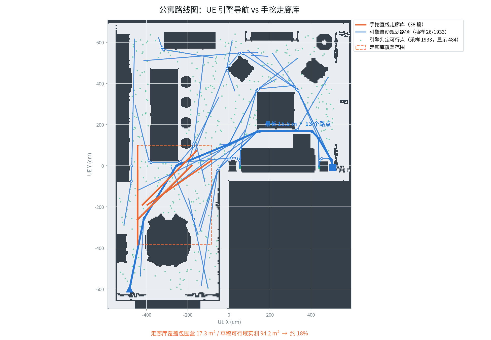

# 公寓路径库：用引擎自己的导航喂出题（20260825）

> 分支 `feature/apartment-polyline-timeline`。全链 research_only、正式分母 0。
> 结论先行：**公寓的路径不再需要手挖，UE 自己的导航系统能直接给，
> 而且"速度 = 弧长 / 5 秒"这个恒等式让自然步速第一次成为可能。**

## 1. 为什么要做

旧流程的路径来源是 `examples/qa_v2/straight_corridor_bank_v1.json`——38 段从
v1 真实轨迹里挖出来的**直线弦**。它有两个连带问题：

1. **速度被房间几何卡死**：直线走 5 秒，长度不能超过房间对角线，于是速度上限
   ≈0.79 m/s。而实测动画隐含步速是**人 1.384 m/s、比格 0.33 m/s**
   （见 `WORLD_CONTACT_BASELINE_20260825.md`），两个物种被同一条 0.60–0.78 的
   带子推向相反的错误：人原地踏步（滑步比 46%）、狗前向滑行（56%）。
2. **覆盖率极低**：38 段实际高度重合，只覆盖公寓可行域的 **约 18%**
   （走廊库包围盒 17.3 m² / 草稿可行域实测 94.2 m²）。pilot48 + batch2d 共
   240 个点位全部产自左下角那一块。

## 2. 事实核查：UE 早就带着导航数据

在打包好的生产 stage 上探测，95 个 actor 里有：

| Actor | 说明 |
|---|---|
| `RecastNavMesh-Default` | 真正的导航网格 |
| `Navigation/NavMeshBoundsVolume` | 导航边界体——**有它才会构建 navmesh** |
| `Navigation/NavModifierVolume_00..07` | 8 个区域修饰体 |
| `AbstractNavData-Default` | 抽象回退（查询返回全 0，**不能用**） |

而 SPEAR 自带 `NavigationService`（`get_random_points` /
`get_random_reachable_points_in_radius` / `find_paths`），我们仓库里
`backends/spear_ue/client/services/navigation_service.py` **早就封装好了，
只是从来没人调用过**。所以这条路不需要重新 cook、不需要开发扩展。

对比一下容易混淆的另一个东西：Studio 场景包里的 `obstacle_map` 自称
`"authority": "acoustic-mesh occupancy heuristic (draft)"`，是从声学网格算的
**启发式草稿**，只能判断"这点能不能站"，**不能寻路**。它适合当俯视图底图，
不能当路径来源。

## 3. SPEAR 导航的调用约定（每条都是踩坑换来的）

这五条已经写进 `tools/m6x/build_apartment_route_bank.py` 的 docstring：

1. 服务挂在 `instance.get_game()` 上，**不在 instance 上**；
2. 读操作要放进 `run_frame_transaction` 的 readback；把 `begin_frame()` 和
   `end_frame()` 写进同一个 `with` **会死锁游戏线程**（进程挂住不动）；
3. **不要拿猜的类名调 `get_static_class`**——猜错会触发 UE 的模态断言弹窗，
   进程卡死直到被杀；
4. `navigation_data` 必须是 `RecastNavMesh` 那个 actor；选到
   `AbstractNavData` 会让所有查询返回 0；
5. `navigation_system` 必须传 world 的 `NavigationSystem` 属性里的
   **原始 uint64 指针**；传类句柄或 PropertyValue 包装对象都会触发
   服务内部的 `SP_ASSERT`。

## 4. 新的三层结构

```
路径生产（引擎，一次性）      tools/m6x/build_apartment_route_bank.py
   ↓ route_bank.json（相机无关）
路径采样（共享库）            src/avengine/route_sampling.py
   ↓ 同一套弧长采样，三处共用
路径消费
   ├─ 渲染器  src/avengine/m5/current_apartment_visual.py（折线时间线）
   └─ 出题器  tools/qa/design_qa_batch.py（闸门在采样点上判定）
```

**为什么路径库是相机无关的**：侧向、可见性都取决于用哪个机位，而机位是另一个
独立维度；一条路径配不同相机有不同的侧向关系。所以库里只存路径自身的属性，
join 留到批次设计阶段——与 target-agnostic 原则一致。

### 库格式（`avengine_apartment_route_bank_v1`）

每条路径存：

| 字段 | 用途 |
|---|---|
| `waypoints_ue_cm` | 引擎返回的原始路点 |
| `arc_length_cm` / `implied_speed_mps` | **速度 = 弧长 / 5 秒**，出题时按目标速度直接筛 |
| `waypoint_count` / `max_turn_deg` | 构图描述量（急转弯读起来像原地扭身） |
| `samples_ue_cm` | 预重采样的 75 帧位置，判闸门零成本 |
| `bbox_ue_cm` | 覆盖统计与分层 |

`max_turn_deg` 是**描述量不是合法性闸门**——合法性由引擎导航决定。

## 5. 首个路径库的实测

`review/apartment_route_bank_20260825T0700Z/route_bank.json`（3.3 MB）：

- 4000 个可行点 → 2000 对 → **1933 条路径**，其中 **1595 条带拐弯**；
- 速度 0.16 – 3.10 m/s，**中位 1.286 m/s**；
- 转角：<30° 有 1208 条、30–60° 有 717 条，**>60° 只有 8 条**——Recast 贴角走得很顺；
- 路点数 2–8+，其中 338 条退化为直线（向后兼容旧走廊库形态）。



*白=可行域、深色=墙与家具（底图来自 Studio 的草稿占用栅格）；蓝线是库中按长度均匀抽样的 26 条路径，空心点是转折路点；橙色是旧的手挖直线走廊库，橙色虚线框是它的覆盖范围——两批共 240 个点位全部产自那个框里。图由 `tools/m6x/plot_route_bank.py` 生成，改完库重跑即可刷新。*

按目标速度筛选（这就是出题时的动作）：

| 目标 | 命中 | 转角 ≤90° |
|---|---|---|
| 人 1.384 m/s ±20% | **598 条** | 598 |
| 人 1.0–1.2 m/s | 229 条 | 228 |
| 比格 0.33 m/s ±20% | 93 条 | 93 |
| 猫 0.5–0.7 m/s | 157 条 | 157 |

**滑步问题就此消除**：不再需要步频缩放这类补丁，让演员按动画的自然步速走一条
足够长的折线即可。

## 6. 代码改动

| 文件 | 改动 |
|---|---|
| `src/avengine/route_sampling.py` | **新增**：弧长采样、重采样、转角、速度恒等式，三处共用 |
| `src/avengine/m5/current_apartment_visual.py` | 折线时间线；改用共享模块（删掉本地重复实现） |
| `tools/m6x/build_apartment_route_bank.py` | **新增**：一次性向引擎批量取路径并落库（自带 scratch 工作目录，避免 SpearSim 往检出目录里写 `tmp/spear_instance_*`——那会让保留工作区的测试从 skip 变成 fail） |
| `tools/m6x/plot_route_bank.py` | **新增**：把路径库画成俯视图，产物入仓 `docs/assets/` |
| `tools/qa/design_qa_batch.py` | 采样器换成 `_at()`（弧长），**闸门逻辑一行未动** |
| `tests/unit/test_route_sampling.py` | **新增** 8 项 |
| `tests/unit/test_apartment_polyline_timeline.py` | 9 项，含"两点路径与旧实现逐位一致" |

**向后兼容**：两点路径继续走原来的直线代码路径，测试逐位比对整条时间线，
旧批次与其证据不受影响。

## 7. 还没做的

- 用新库跑一次真实的四点 mini-pilot（视觉 + 音频 + 出题 + 人工看片）；
- 覆盖率作为批次设计指标（别再挤在 18% 里）；
- Kujiale / MP3D 各自的路径来源接同一个采样库（MP3D 已有 PathFinder 折线，
  只是没走这个共享模块）；
- 猫的动画隐含步速尚未实测（生成猫资产时补）。
