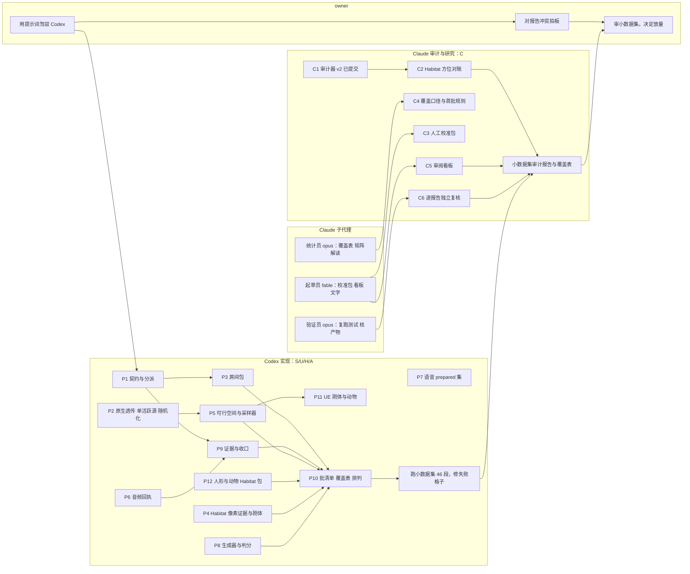

# 小数据集先行与整体分工（Claude，2026-09-06 晚）

owner 2026-09-06 晚的两条决定：第一，最终目标按 `QA_PRODUCTION_ARCHITECTURE_20260906.md` 第 6 节的定义，四个房间家族乘人、动物、设备三类声源，每一格至少一条经过验证的原生路径，所有资产都进两个渲染器，不分梯队；第二，先按这个目标出一个小数据集给 owner 过一遍，再决定要不要放量。这份文档定小数据集长什么样、给 owner 看什么、谁负责什么、子代理怎么分。

## 1. 小数据集的定义

**格子。**声源两两组合有六种：人加人、人加动物、人加设备、动物加动物、动物加设备、设备加设备。四个家族各六格是 24 格，自建 A、B、C 各六格是 18 格对照，合计 42 段主体。另外每个家族各加 1 段"两个实体、一个沉默"的段给 QA-01 和 QA-22 的负例用，共 4 段。小数据集一共 46 段，每段 16 秒、静止相机、两个声源资产同时在场。

**条件。**五个条件组（身份关联、即时音频与事件关系、可见性与遮挡、运动与距离、声停后状态）在每个家族里都至少出现一次，由批清单预分配，不靠运行时抢。每段 24 类题都尝试，按题义适用，每类每段随机一题。角距箱按 Codex 矩阵和片长过滤实验的产出率配：两人 30 到 60 度为主，15 到 30 度和 60 到 90 度各留少量，90 度以上只在竞争者画外的画像里尝试。

**通过标准。**小数据集不用成功率评判，用覆盖表：每一格都要有五态之一（produced、deferred_by_rule、not_applicable_by_definition、interface_not_implemented、evidence_missing_or_unsampled），凡是没出片的格子写清卡在哪一步。

**成本。**UE 家族 30 段按已测的每段 400 到 450 秒算，串行约 3.3 到 3.8 小时；Habitat 家族 12 段加沉默者段的每段成本没有测过，第一段跑完再报。

**前置。**小数据集要全矩阵齐了才算完成，也就是 P1 契约、P2 原生透传与单活跃源、P3 房间包、P4 Habitat 像素证据与刚体、P12 人形与生成动物的 Habitat 包、P6 音频回执、P8 生成器最小版、P9 收口都到位。P12 是最长的一条；在它到位之前，可以先给 owner 看一版"中间检查点"，明确标注 Habitat 家族缺人形格子，但那不是小数据集本身。

## 2. 给 owner 看什么

每段交付：成片 mp4（双耳音轨）、facts.json、questions.json（题面、金标、证据、拒出原因）、审计器 v2 报告、起点帧与查询时刻帧的截图。

整批交付：五态覆盖表（QA 类型乘声源类别乘房间家族，家族内不同场景分行）、结构基线（只看视觉结构的常数策略命中数）、音频电平与 stem 可听窗汇总、10 条 prepared 语音和 5 段成片的人工抽听记录、失败格子的卡点表。

看板规则沿用 owner 之前定的三条：不要求看片听声才能判，机器算出来的证据摆在旁边；一页平铺不用点开；严格懒加载。看板由 Claude 负责，子代理起草页面，我审过再交。

决策门：owner 看完小数据集决定三件事：放不放量、哪些格子先放量、每格配额怎么给。

## 3. 分工

**owner。**拿 `CODEX_TASK_PROMPTS_20260906.md` 驾驭 Codex；接收每份任务报告；对报告里标出的冲突拍板；审小数据集；决定放量。不做源码。

**Codex（实现方）。**S、U、H、A 四条线的全部源码任务，按提示词 P1 到 P12。并行规则按文件占用切：P1（契约）、P4（Habitat 像素证据与刚体）、P7（语音集）、P12（资产包）文件不重叠，可以同时开；P2 和 P5 都改 `qa_episode.py`，P2 先、P5 后；P3 房间包依赖 P1 的校验器；P6 音频回执独立，P9 收口依赖 P1 和 P6；P8 生成器独立；P11 依赖 P2 之后的 `qa_episode.py`；P10 批清单最后；然后跑小数据集并修失败格子。

**Claude（审计与研究方）。**C1 审计器 v2 已提交（02df947）；C2 Habitat 方位对账测试，等 P1 出第一段 Habitat 中立读回；C3 人工校准包；C4 覆盖表统计口径与首批构成规则；C5 审阅看板；C6 对 Codex 每份报告做独立复核：重跑它列的测试、打开验收产物、复算它报的数字，不改 Codex 名下文件。小数据集出来后写审计报告和覆盖表解读。

**Claude 的子代理。**三种角色、两种模型：

| 角色 | 模型 | 做什么 | 不做什么 |
|---|---|---|---|
| 验证员 | opus | 每份 Codex 报告一个：复跑测试、打开验收产物、对数字，输出核对表 | 不改任何文件 |
| 起草员 | fable | 校准包题面与记录表、审阅看板页面初稿、长文报告初稿 | 不碰服务器源码 |
| 统计员 | opus | 覆盖表汇总、plan-only 矩阵与结构基线的计算脚本 | 不下结论给 owner |

规则：子代理不改 Codex 名下文件；只在本机写草稿或只读服务器；成果先经我审再进仓库；每个子代理的任务书自成一体，写明输入路径与输出路径；需要精确复核和数值的用 opus，长文写作用 fable；重要结论不由子代理直接给 owner，由我核过后转述。

**时间线分三段，不给日历承诺。**第一段契约与资产：P1、P2、P4、P7、P12 并行，Claude 做 C4 与接口意见，验证员跟报告。第二段执行器与采样器：P3、P5、P6、P8、P9、P11、P10，Claude 做 C2、C3、C5。第三段小数据集与审阅：Codex 跑 46 段并修失败格子，Claude 出审计报告、覆盖表和看板，owner 审后决定放量。

## 4. 分工图

